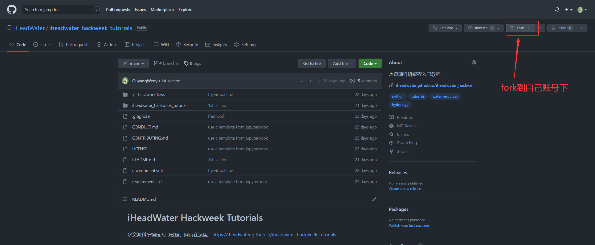
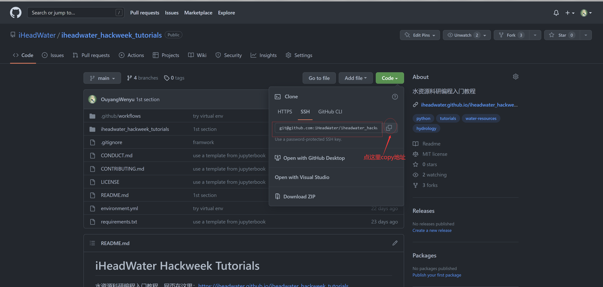

# 关于Git和GitHub

当我们首次使用 **Git** 和 **GitHub** 时，我们可能会存在疑问：什么是 **Git** ？什么是**Github**？ 二者之间有什么区别？相信阅读完本节后，我们对于 **Git** 与**GitHub** 可以有更深的理解与认识，下边是对二者的一些介绍。


**Git**是一个分布式版本控制系统[Git下载](https://git-scm.com/downloads)，下面将分解并解释各个措辞：

- 版本控制系统：版本控制系统（version control system）是一种用来记录一个或若干文件内容变化，以便将来查阅特定版本修订情况的系统。 版本控制系统不仅可以应用于软件源代码的文本文件，而且可以对任何类型的文件进行版本控制。Git 是一个全世界开发者都在用的版本控制系统。它会帮助你与其他开发者合作，以及跟踪你不同版本的代码。

- 分布式版本控制系统（Distributed Version Control System，简称 DVCS）：分布式版本控制系统可以指定若干不同的远端代码仓库进行交互。通过版本控制系统我们可以在同一个项目中，分别和不同工作小组的人相互协作。 同时，我们可以根据需要设定不同的协作流程，比如层次模型式的工作流，而这在以前的集中式系统中是无法实现的。Git有一个存储在服务器中的远程存储库和一个存储在每个开发人员计算机中的本地存储库，这意味着代码不仅存储在中央服务器中，而且代码的完整副本存在于所有开发人员的计算机上。Git作为一个分布式版本控制系统，其代码存在于每个开发人员的计算机上。

**Git** 允许多个开发人员或其他贡献者处理一个项目，它提供了一种使用一个或多个本地分支并将其推送到远程存储库的方法，它所提供的主要功能包括：

- 能在本地计算机上安装和使用；

- 能够用以处理版本控制

- 支持分支

**为什么我们需要像**Git**这样的版本控制系统？**

- 通常来说，一个项目需要多个开发人员并行工作，因此，需要像 **Git** 这样的版本控制系统来确保开发人员之间没有代码冲突。

- 项目中的要求经常变化。因此，版本控制系统允许开发人员还原并返回到旧版本的代码。

- 有时并行运行的多个项目涉及相同的代码库。在这种情况下，**Git** 中分支的概念非常重要。

总而言之，**Git** 是一个可以下载到我们电脑上的分布式版本控制系统。如果我们想在一个编码项目里和其他开发者合作，或者是我们自己的项目里，那么使用 **Git** 是必不可少的！


**Github** 是一个以**Git** 为核心技术的云平台，[GitHub](https://github.com/)简化了开发人员在项目上进行协作的过程，并提供了一个网站、命令行工具和整体流程，它允许开发人员和用户一起工作，并且允许我们将文件储存在云端以便我们可以从任意一台电脑上对其进行访问。**GitHub** 充当前面在 **Git** 部分中提到的“远程存储库”.其提供的主要功能包括：

- **GitHub** 上有海量的代码资源，我们一定可以在**GitHub** 中找到我们想要的代码。
- **GitHub** 中的资源以仓库为单位，我们可以为每一个事件、项目等新建一个仓库，我们也可以将其他人的仓库完整地克隆到我们自己的 **GitHub** 主页下，或者将 **GitHub** 中仓库完整地克隆到本地计算机。

总而言之， **GitHub**  是一个代码托管云服务网站，主要用于软件开发者存储和管理其项目源代码，且能够追踪、记录并控制用户对其代码的修改。 甚至我们可以简单粗暴的把它当作一个网盘，用来存储任何东西。一定要注意，**Github** 不是 **Git**，**GitHub**只提供托管服务！

接下来自己去注册一个Github账号吧。

如果你不能科学上网，导致Github的访问很慢，或者根本就不能访问，那这边还是建议自己想办法解决下这个问题。

接下来我们把本代码仓拉下来。

1. 打开GitHub上的本代码仓：https://github.com/iHeadWater/iheadwater_hackweek_tutorials
2. fork到自己GitHub账号下：
3. 使用Git Clone命令clone下来。还记得刚刚提到了我们能使用Bash打开和运行软件吗，这里我们在使用Bash操作Git去下载本教程，在平台终端上输入以下命令：

```Shell
# 如果你想创建一个新文件夹放这些代码就执行：
mkdir xx
# 移动到你想放的文件夹
cd xx
# 把代码clone下来，xxx是项目的地址
git clone xxx
```

xxx项目地址在你fork后的页面上，如下操作（点击绿色的code按钮，然后再点击图中所示的copy图标）即可看到：


