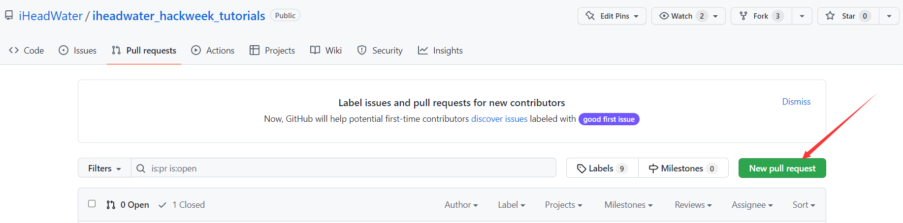
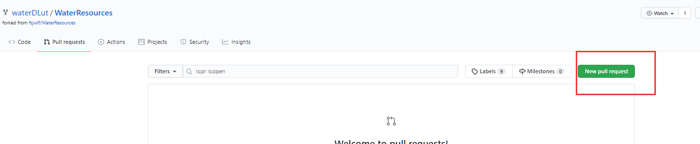

# 使用Git命令进行版本控制

通过前面两部分的学习，相信大家已经学会了如何`fork` GitHub 仓库以复制其他用户的仓库，也掌握了如何下载 GitHub 仓库的副本（即克隆）到本地电脑上。那么在这一节，我们将学习使用 git 来实现版本控制的三个重要步骤。如下所示：

- `git add` 对已更改的文件进行版本控制跟踪
- `git commit` 改变文件来创建本地版本库的唯一快照
- `git push`这些改变的文件，从本地仓库的副本到云端（GitHub.com）。

## 1. git status 检查更改的状态

首先，我们需要了解到的是，git内部主要有untrack,modified,staged和committed四种状态。在开始工作之前，**我们先克隆一个远程GitHub仓库到本地**。用**终端**导航到实践**git**的地方`$ cd iheadwater_hackweek_tutorials`，也可以进入这个文件夹之后再打开终端，之后我们来看一下不同的状态吧。

**untrack**，可以理解为没有记录，没有跟踪的意思，我们新创建一个**try**文件，它其实就是这个状态，没有经过任何改动。

**modified**，即修改过，我们可以随便修改一个已经存在的文件,写入一些文字或者进行修改，可以输入`git status`查看一下，就可以看到**modified**的提示。

**staged**，可以大概理解为暂存的状态，我们修改完文件之后，输入`git add .`命令就可以把改动添加到暂存区。

**committed**，即已提交，我们输入`git commit`命令就是将对文件的修改进行提交。

```Python
git status
```
我们先来看看如何用**git**来跟踪这个文件的变化:

1. 先用`git add`把改动添加到跟踪区（暂存区）
2. `git commit`对版本控制的更改

以上两条命令构成了许多使用**git**进行版本控制的工作流程的主体，可以简单解释如下，具体操作我们可以参考后面的部分。

- git add：在工作目录中获取一个修改过的文件，并将修改后的版本放在一个暂存区供审查。
- git commit：从暂存区获取所有内容，并为仓库的当前状态制作一个具有唯一标识符的永久快照。

**补充**：除了在终端里使用`git status`命令来查看文件的状态之外，我们还可以使用如图的方式来查看，也可以将文件的状态“后退”(“-”即可)。大家可以自己操作一下来看看发生了什么变化。

接下来，我们再一起看看命令`git add`。

## 2. 使用git add添加已更改的文件

在我们进行修改后，可以将单个文件或文件组添加到版本控制跟踪中。那么要如何添加**单个文件**，可以运行以下命令：

```Python
git add file-name.extension
```

举个简单的例子，如果想要添加`README.md`文件，可以使用：

```Python
git add README.md
```

我们也可以同时添加**所有编辑过的文件**，使用：

```Python
git add .
```

## 3. 用git commit提交修改过的文件

如果我们想要将文件从暂存区移出，就可以运行`git commit`。通常`git commit` 命令后面还需要添加一个提交信息，用来描述我们在该次提交中所做的改动。这样的话就能更好地进行多人协作的工作，同时也可以：

1. 帮助合作者和未来的自己了解哪些地方被修改了，为什么。
2. 让我们和合作者能够找到（必要时撤销）之前所做的修改。

如果没有提交大量的修改时，可以使用 `-m` 标志创建一个简短的单行提交信息，如下所示。

```Python
git commit -m "Update title and author name in homework for week 3"
```

每个提交都有一个唯一的标识符（SHA-1哈希值），并包括提交时对暂存区文件的所有修改（即用`git add`添加到暂存区的所有文件）

## 4. 推送修改后的文件到GitHub.com

到目前的操作为止，我们只是修改了仓库的本地副本并完成了对仓库的本地提交。如果我们想要更新 **GitHub.com** 上的文件，则还需要把修改的文件**push(推送)** 到 **GitHub.com** 上的仓库。

这时就可以用以下命令把改动推送到 **GitHub**:

```Python
git push origin main
```

**补充：** main是远程的（主）分支。在具体的操作前，我们可以先通过一张图来简单地了解一下分支的概念。我们可以将分支简单地理解成一条平行直线，每个分支都能够进行版本控制，并且团队协作中的每个人都可以创建一个属于自己的分支，然后在自己的分支上进行修改等事宜。这样就把我们的工作从开发主线上分离开来，避免了影响开发主线。版本控制还允许我们将分支进行融合等操作。


**下面我们就创建一个分支，并将分支推送到远程仓库（分支）下**

### 4.1 创建分支并推送到远程分支

首先，输入以下命令查看当前分支：

```Python
git branch
```

**出现`*`表示当前处在该分支下**

下一步，再新建一个本地分支：

```Python
git checkout -b  <你的分支名称>
```

比如常见的新建一个“开发”分支：`git checkout -b dev`

虽然我们已经建立了分支，但可以看到 * 并没有出现在dev上面，这时我们可以输入：

```Python
git checkout dev
```

即可切换到dev分支上。通过以上操作，我们可以清楚地认识到命令`git checkout`是用于切换分支的。

下一步，我们需要把新建的本地分支push到远程服务器，远程分支与本地分支同名（当然可以随意起名）：

```Python
git push origin <你的分支名称>:<你的分支名称>
```

最后，我们来使用命令`git branch -a`查看一下所有分支，此时就会看到remotes/origin/<你的分支名称> 这个远程分支，这就说明新建远程分支成功。

### 4.2 拉取远程分支

首先，我们查看一下**远程**分支：

```Python
git branch -r
```

然后，我们来看一下拉取远程分支的方式。第一种方式：

```Python
git checkout -b 本地分支名x origin/远程分支名x  
```

需要注意的是，使用该方式会在本地新建分支 x ，并自动切换到该本地分支 x 。采用此种方法建立的本地分支会和远程分支建立映射关系。

方式二：

```Python
git fetch origin 远程分支名x:本地分支名x  
```

使用该方式会在本地新建分支x，但是不会自动切换到该本地分支x，需要手动checkout。

采用此种方法建立的本地分支不会和远程分支建立映射关系。以上就是拉取远程分支的两种方式。

当我们在 dev 分支完成了自己的部分时，主分支并不会发生变化，这个时候就需要把我们的代码合并到主分支 main 上来，执行`git merge`命令就可以合并分支。

需注意，合并分为两步！！！

1. 切换到 main 分支，如果你已经在了就不用切换了;
2. 执行 `git merge dev` ，意思就是把 dev 分支的代码合并过来，不出意外，这个时候 dev分支的代码就顺利合并到 main 分支来了。

有添加就有删除，假如分支新建错了，或者dev分支的代码已经顺利合并到 main 分支来了，那么 dev 分支没用了，我们可以用 `git branch -d` 删除。删除分支dev 的语句为 `git branch -d dev` 。

### 4.3 pull request

我们在之前已经介绍过如何创建分支并且推送到远程，那么现在自己的github上已经有了创建的dev分支，这个分支将是随后发起 Pull Request 时要用到的源分支。

首先，点击项目简介下的 **Pull Request** 按钮(左上角)

再点击**New Pull Request**



最后点击**Create Pull Request**即可，其中自己的仓库默认设置为源仓库（head fork）、询问指定源分支（compare）、目标仓库（base fork）和目标分支（base）。



通过以上的步骤，对方就会在在他自己的 GitHub 仓库下的**Pull Request**选项卡中看到所有的**Pull Request**。点击 **Pull Request** 会显示这个**Pull Request**的简介、dev 分支的提交历史，以及这次提交包含的更改。

如果对方认为 dev 分支已经可以合并了，他只需点击 **Merge Pull Request**按钮来通过这个 **Pull Request**，将dev分支并入他的 **main** 分支。

最后，对方接受了这些修改，将 dev 分支并入了 main 分支，关闭了这个**Pull Request**。通过以上的操作，所修改的东西现在也已经整合到了项目中，这时其他在 main 分支上工作的开发者就可以使用标准的 **git pull** 命令将这些修改拉取到自己的本地仓库。

### 4.4 fork后同步源仓库新更新的内容

在我们fork了其他人的repo后，如果他们的内容有更新，我们又应该怎样把他们的最新内容同步过来呢？

首先，我们需要先查看远程状态:

```Python
git remote -v
```

接着确定一个将被同步给 fork 远程的上游仓库:

```Python
git remote add upstream git@github.com:iHeadWater/iheadwater_hackweek_tutorials.git
```

然后再次查看远程状态，已经可以看到upstream的信息了。

随后从上游仓库 fetch 分支：

```Python
git fetch upstream
```

转换到main(或者master)分支

```Python
git checkout main
```

最后就是合并远程分支：

```Python
git merge upstream/main
# 或者
git rebase upstream/main
```

如果本地没有更改，那git就直接自动执行一个fast-forward，如果有更改，就手动调整一下有冲突的地方，然后commit即可。

最后push到自己的origin上即可。

```Python
git push
```

### 4.5 查看历史版本

我们可以使用以下的命令：

```Python
git log
```

来查看历史提交记录。

同时，如果使用

```Python
git checkout xxx（某个历史版本的哈希值，即git log下显示的每次commit对应的一串数字字母）
```

即可回到xxx的那个版本。

## 5. 从GitHub.com上拉出修改过的文件到克隆Repo上

当我们运行`git clone`时，会将 git repo的完整副本从github.com复制到本地计算机。它包括所有的.git历史信息，我们需要这些信息来跟踪repo的变化。**因此我们只需要运行一次git clone**。运行完git clone后，就可以用`git pull`来更新 repo。

注意：`git add`、`git commit`和`git push`是将本地的修改推送到远程，而`git pull`是从远程库中获取某个分支的更新，再与本地指定的分支进行自动merge。

首先，查看我们处于哪个分支，因为我们可能会有许多分支，但是只需对特定分支进行更新。

```Python
git branch
```

再查看一下远程分支：

```Python
git branch -r
```

运行`git pull`

```Python
git pull <远程库名> <远程分支名>:<本地分支名>
```

举个例子，如果我们想要取回远程库中的dev分支，并与本地的dev分支进行merge，就可以写成：

```Python
git pull origin dev:dev
```

**如果是要与本地当前分支merge，则冒号后面的<本地分支名>可以不写。**

通常，git会将本地库分支与远程分支之间建立一种追踪关系。比如，在git clone的时候，所有本地分支默认与远程库的同名分支建立追踪关系。也就是说，本地的main分支自动追踪origin/main分支。因此，如果当前处于本地dev分支上，并且本地dev分支与远程的dev分支有追踪关系，那么远程的分支名可以省略：

```Python
git pull origin
```

## 6. 用.gitignore文件告诉 Git 忽略文件

有时我们不想在git repo中有些文件被追踪到。例如：

- _DS_STORE or
- .ipynb checkpoint files.

其他时候，如果我们仓库里有敏感的文件，永远不想用**git**来追踪，比如API凭证或其他包含个人信息的文件。这个时候我们就可以把任何文件类型或名称添加到`.gitignore`文件中，这样**git**就不会追踪它们。这意味着，当运行`git add`或`git status`时，它将不会追踪任何列在`.gitignore`文件中的文件。因此，这些文件将永远不会被添加到 **GitHub.com** 上。

我们看一个简单的例子，假设有一个名为 `social-security.txt` 的文件，其中包含敏感信息。我们可以将该文件添加到一个 **.gitignore**文件中。如果仓库中还没有 **.gitignore**文件，可以用文本手动创建，或者使用下面的`bash`命令。

在文本编辑器中打开这个`.gitignore`文件，添加**git**忽略的文件名（不需要其他信息），比如说:`social-security.txt`

任何列在`.gitignore`文件中的文件都会被**git**忽略。另外我们也可以通过在`gitignore`文件中添加目录名称来告诉**git**忽略目录（比如忽略一个名为`private-directory`的目录）