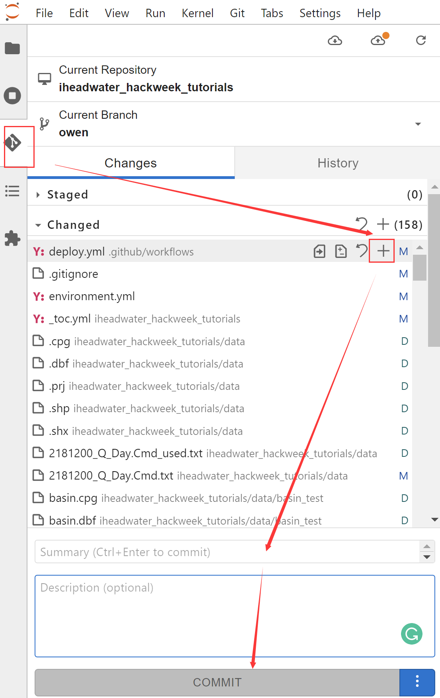
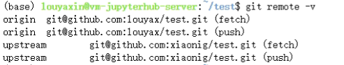

# 在GitHub上协作工作

通过前面的章节我们已经学习到Git与GitHub的一些基本用法，在本节中，我们来看看两人如何一起在GitHub中协同工作。

## 甲同志

### 1. GitHub中创建代码仓

我们在做项目的过程中，可能会需要将一些软件代码储存在GitHub中来方便团队协作，那么如何在GitHub中上传文件呢？我们可以按照以下步骤：

一、 新建一个存储仓库

填写项目说明：

1. 填写仓库名称；

2. 仓库说明描述；

3. 根据需要确定所创建的仓库是Public or Private (Public是公开仓库，可以在GitHub上搜到，Private是私密仓库，只有自己和成员才能看到）；

4. 点击Create repository（创建仓库），生成如下页面，在这里我们需要复制仓库的链接，后面会用到。

二、 将本地文件上传到GitHub主页中

1. 在文件夹中找到所要上传的项目，打开本地终端
2. 输入`git clone xxx`，xxx是之前在GitHub复制的链接
3. 输入`cd 刚clone下来文件夹名称`
4. 输入`git status`: 查看当前状态
5. 输入`git add -A`：将所有修改添加到仓库中，如果想添加某个特定的文件，只需要把-A换成特定的文件名即可
7. 输入`git commit -m 对信息的描述`
8. 输入`git push` 将代码上传到github仓库
9. 返回自己的GitHub仓库中查看文件是否提交成功

在平台jupyterlab上，有安装git插件，通过git插件也可以执行同样的操作：

### 2. 创建分支

Git分支是由指针管理起来的，所以创建、切换、合并、删除分支都非常快，非常适合大型项目的开发。在分支上做开发，调试好了后再合并到主分支。那么每个人开发模块式都不会影响到别人，这里有一些使用分支的策略，供大家参考：

- 主分支（默认创建的main分支）只用来分布重大版本（对于每个版本可以创建不同的标签，以便于查找）；
- 日常开发可以在另一条分支上完成，可以取名为dev；
- 临时性分支，用完后最好删除，以免分支混乱。

怎样创建分支呢？按照以下步骤执行即可：

1. 输入`git branch`,查看分支信息；
2. 输入`git branch dev`，创建新分支dev；
3. 输入`git switch dev`，切换至dev分支；
4. 如果想要往dev分支传送文件时，步骤和主分支类似，先add和commit，最后推送时推送到远程dev分支即可：`git push origin dev`。
5. 输入完成后，在自己的GitHub主页上查看是否创建成功。

## 乙同志：和甲协作

通过以上的内容，甲同志就已经成功创造了一个可以供多人协作的空间。那么我们又该怎样跟他来进行协作呢？我们可以通过以下步骤：

### 1. 将甲同志的项目 fork 到我们的仓库

首先需要进入甲同志的仓库中(通过网址进入即可)，点击右上角 fork ，我们就可以在自己的主页中看到**test**。(详细讲述可参照3.1部分内容)

### 2. 克隆项目到本地

1. 在本地的Git Bash 上，输入`git clone 项目地址`，克隆仓库到本地。**注意：**这里的地址是我们自己仓库里的地址。

2. 进入本地**test**所在的文件夹。

3. 在克隆后，我们输入`git branch`来查看所有的分支，这时会发现我们只有 main 分支。再输入`git branch -a`，查看所有分支，就能够看到远程分支。

4. 输入`git checkout -b dev origin/dev`

5. 输入`git branch`看一下我们本地的分支，确认一下是否已经完成。

### 3. 和团队项目保持同步

通过前面两部分，我们就可以在自己的本地上进行修改。但是我们无法获取甲同志最新的修改。那么这时候，我们就需要一些操作来保证与甲同志项目的同步。

1. 输入`git remote -v`来看一下我们有没有设置 upstream 。

**补充：**对于 upstream ，我们用简单的一句话来理解就是，我们 fork 了一个项目，origin 则指向我们自己的项目，那么 upstream 指向 fork 的项目。

2. 如果没有显示 upstream ,我们可以使用`git remote add upstream 团队项目地址`命令。随后再次使用`git remote -v`，我们就可以看到 upstream 已经设置好了。**注意：**这里的地址，应该是甲同志的地址。

3. 开始进行同步。输入`git fetch upstream`来获取甲同志项目的最新版本。需要注意的是，经过上述的操作，我们并没有把最新版本合并到我们自己本地的分支上，因此还需要一步。输入`git merge upstream/dev`命令，就可以合并完成。

**注意：**如果甲同志的项目中，有人和我们一起修改同一个文件，就可能会造成冲突。这一步就会发现提示CONFLICT，那我们就需要先解决冲突。方法也很简单，让我们一起来看一下吧。

1. 重新打开提示冲突的文件，把冲突的标识符以及我们不需要的东西删除，保留需要的东西。**冲突的标识符由<<<<<<<、=======、>>>>>>>组成**。

2. 输入`git status`命令检查状态，并按照提示依次输入`git add`和`git commit -a`命令。

通过以上的操作，我们就将冲突解决了，之后就可以顺利地进行 push 等操作了。

### 4. push 修改到自己的仓库中

在这里我们输入`git push`命令，就可以将本地的修改上传到自己的仓库中了。

### 5. 请求合并到团队项目

通过前面几部分的内容，我们在本地的修改就成功地传到了自己的Git Hub 仓库中，这部分内容主要是如何将自己修改的内容合并到团队项目中，简单来说就是发起**pull request**。相信大家会觉得这部分内容似曾相识，其实就在上一章节里的5.3学习过了。那在这里我们就不讲述了，可以参考5.3的内容。

以上我们就完成了和甲同志的协作，希望对大家有所帮助！

**补充：**如果我们在.ipynb文件里面发现了冲突，与上述解决办法相似，将冲突的标识符以及不需要的内容删除，只保留想要的部分即可。