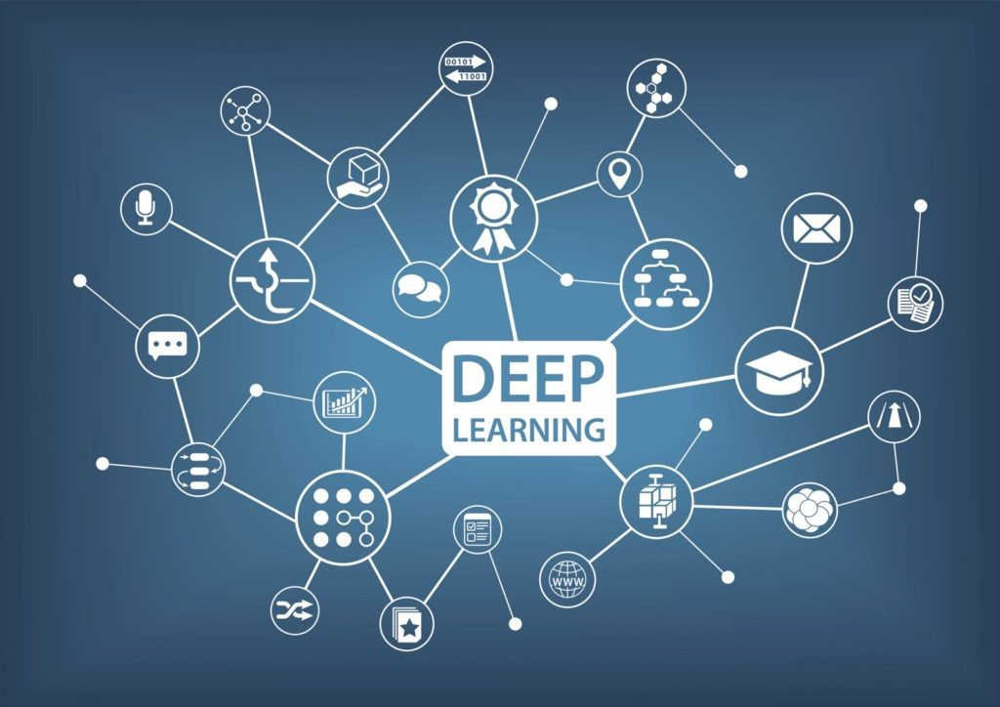
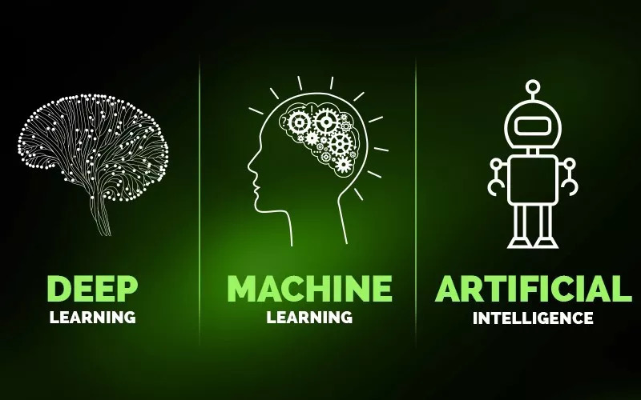

# 深度学习简介

近几年深度学习发展迅猛，更是在2016年3月，由谷歌（Google）旗下DeepMind公司开发的AlphaGo(基于深度学习)与围棋世界冠军、职业九段棋手李世石进行围棋人机大战，以4比1的总比分获胜而轰动一时，国内也开始迎来这一技术的研究热潮，本章主要是讲述了深度学习的一些基本概念及原理，为后续我们的教程培训以及一些相关软件的学习奠定基础，那么深度学习是什么呢？或者说深度学习的机理是什么呢？下面我们一起来看看吧！

## 深度学习、机器学习、人工智能的关系

在学习之前，我们首先要搞清楚深度学习、机器学习与人工智能三者之间的联系与区别。当今，人工智能中的两大热点“学习”，即Deep Learning（深度学习）和Machine Learning（机器学习）。那么我们可能会存在一些疑问，比如说什么是人工智能呢？什么是机器学习呢？什么是深度学习呢？三者之间有什么关系呢？让我们带着这些疑问继续向下看。

人工智能（Artificial Intelligence, AI）是机器，尤其是计算机系统对人类智能过程的模拟，它是一个愿景，目标就是让机器像我们人类一样思考与行动，能够代替我们人类去做各种各样的工作。人工智能研究的范围非常广，包括演绎、推理和解决问题、知识表示、学习、运动和控制、数据挖掘等众多领域。其中，知识表示是人工智能领域的核心研究问题之一，它的目标是让机器存储相应的知识，并且能够按照某种规则推理演绎得到新的知识。许多问题的解决都需要先验知识

机器学习（Machine Learning）是一门专门研究计算机怎样模拟或实现人类的学习行为，以获取新的知识或技能，重新组织已有的知识结构使之不断改善自身的性能的学科。

深度学习（Deep Learning）是机器学习的分支，主要特点是使用多层非线性处理单元进行特征提取和转换。每个连续的图层使用前一层的输出作为输入，与传统的机器学习相比，深度学习主要突出了以下几点：

（1）强调了模型结构的重要性：深度学习所使用的深层神经网络（Deep Neural Network，DNN）算法中，隐藏层往往会有多层，是具有多个隐藏层的深层神经网络，而不是传统“浅层神经网络”，这也正是“深度学习”的名称由来。

（2）强调非线性处理：线性函数的特点是具备齐次性和可加性，因此线性函数的叠加仍然是线性函数，如果不采用非线性转换，多层的线性神经网络就会退化成单层的神经网络，最终导致学习能力低下。深度学习引入激活函数，实现对计算结果的非线性转换，避免多层神经网络退化成单层神经网络，极大地提高了学习能力。

（3）特征提取和特征转换：深层神经网络可以自动提取特征，将简单的特征组合成复杂的特征，也就是说，通过逐层特征转换，将样本在原空间的特征转换为更高维度空间的特征，从而使分类或预测更加容易。与人工提取复杂特征的方法相比，利用大数据来学习特征，能够更快速、方便地刻画数据丰富的内在信息。

我们可以将三者之间的关系概括为一张图，如下：

以上便是对深度学习的一些介绍，相信阅读完本节之后，我们对深度学习有了更多的了解，那么深度学习在水文领域有什么应用呢？其基本算法以及一些基本的模型有哪些呢?带着这些疑问，让我们继续学习吧！

