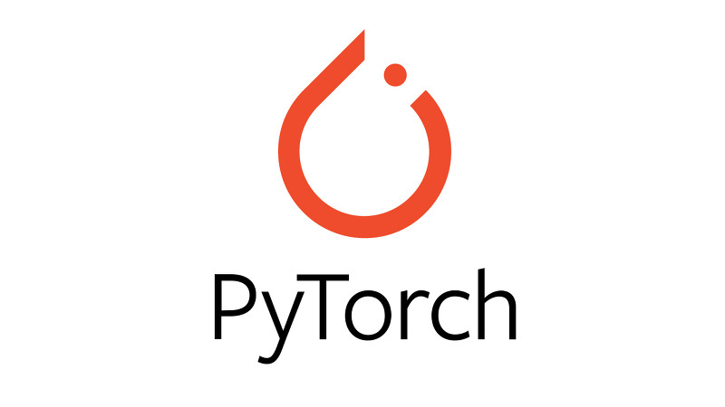
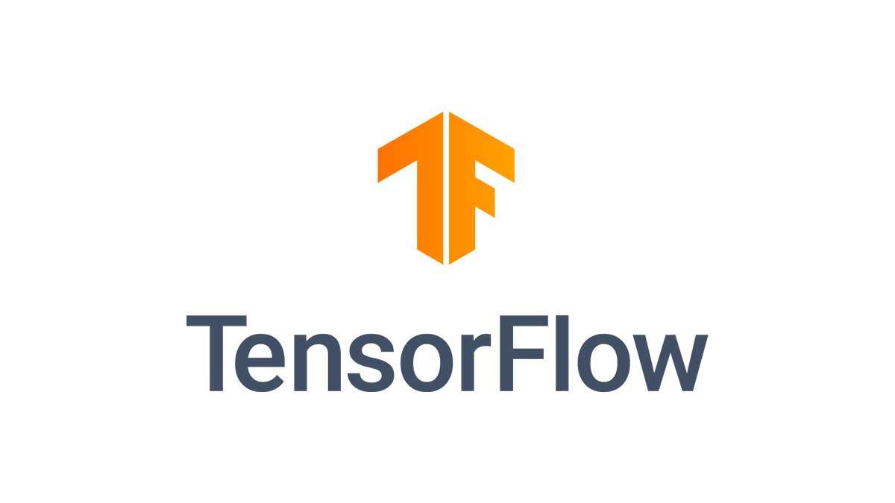
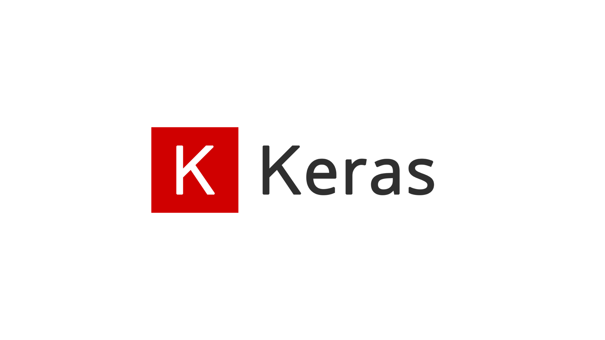

# 初探PyTorch

在前边的一章中，我们已经学习了深度学习的一些基本概念以及一些模型算法，那么我们可能会存在一些疑问，比如说深度学习需要哪些工具呢？这些工具如何使用呢？本节我们将介绍深度学习最常用的工具之一 **PyTorch**。

## 什么是PyTorch？

在介绍PyTorch之前，我们先简单的介绍Torch。Torch是一个有大量机器学习算法支持的科学计算框架，它是一个与 **Numpy**类似的**张量**，其特点是特别灵活，但是因为其采用了小众的编程语言Lua，所以流行性不高，这也就有了PyTorch的出现。PyTorch是Torch的Python版本，它是由Facebook开源的神经网络框架，专门针对**GPU**加速的深度神经网络编程。作为经典机器学习库Torch 的端口，PyTorch为Python语言使用者提供了舒适的写代码选择。

- NumPy: 它是Python语言的一个扩展程序库。支持高阶大量的维度数组与矩阵运算，此外也针对数组运算提供大量的数学函数库。
- 张量：张量（Tensor）是一个多维数据结构，向量是一组数据结构，矩阵是二维数据结构，张量表面上与这些其他数据结构相似，但是不同之处在于它可以存在与从0到n的维度范围内，也就是说张量是遵循特定的变换规则，张量是动态的。
- GPU：图形处理器，一种专门在个人电脑、工作站、游戏机和一些移动设备上执行绘图运算工作的微处理器。

## 为什么选择Pytorch？

目前常用的深度学习库有TensorFlow、Keras 和 PyTorch，下边将对其进行简单的介绍。

### TensorFlow

TensorFlow 是由谷歌设计和开发的开源机器学习平台。它提供了一种非常高级和抽象的方法来组织低级数值编程，可以让我们的软件在常规 CPU 上运行而无需更改，但其仍有一些缺点：

- 发生错误时较难调试；
- 代码较为复杂；
- 接口说明内容较多不易学习等。

### Keras 

Keras是基于Tensorflow用纯python编写的深度学习框架，也就是说它是在Tensorflow的基础上再次集成的，所以，它的代码会更加简洁方便，适于初学者；但因为它是在Tensorflow的框架上再次封装的，所以其仍有一些缺点：

- 运行速度慢；
- 同样较难调试。

### Pytorch

相比于Tensorflow、Keras，PyTorch具有以下优点：

1. 简洁：
PyTorch的设计追求最少的封装，简洁的设计带来的另外一个好处就是代码易于理解。PyTorch的源码只有TensorFlow的十分之一左右,更直观的设计使得PyTorch的源码十分易于阅读。

2. 易用：
PyTorch的设计最符合人们的思维，它让用户尽可能地专注于实现自己的想法，所思即所得，不需要考虑太多关于框架本身的束缚。

3. 速度：
PyTorch 的灵活性不以速度为代价，在许多评测中，PyTorch 的速度表现胜过 TensorFlow 和 Keras 等框架。框架的运行速度和编程者的编码水平有极大关系，但同样的算法，使用PyTorch比使用其他框架实现的更快。

4. 活跃的社区：
PyTorch 提供了完整的[文档](https://pytorch.org/tutorials/)，循序渐进的指南，作者亲自维护的论坛供用户交流和求教问题。Facebook 人工智能研究院对 PyTorch 提供了强力支持，作为当今排名前三的深度学习研究机构，FAIR的支持足以确保PyTorch获得持续的开发更新，不至于像许多由个人开发的框架那样昙花一现。

5. 更适合科研编程：
PyTorch 最大优势是建立的神经网络是动态的, 而PyTorch对于动态输入的支持比较有限。所谓静态图和动态图，这里做了简单的介绍：

- 动态图： 计算图的运算与搭建同时进行，这种机制由于能够实时得到中间结果的值可以使调试更加容易，同时我们将大脑中的想法转化为代码方案也变得更加容易，对于编程来说更加友好;
- 静态图： 计算图的搭建和实际运算是分开的，在静态图中，会事先定义好整个运算流，这样之后再次运行的时候就不需要再重新构建计算图了，所以说速度会比动态图快（不过根据测评，pytorch并不慢），但这也意味着我们所期望的程序与编译器实际执行之间会存在更多的代沟，代码中的错误较难发现，无法像动态图一样随时拿到中间计算结果。

## Pytorch常用的工具包有哪些？

- torch.nn：用来搭建神经网络层的模块和一系列loss函数等；
- dataset与dataloader：用来进行加载训练、测试数据等.

那么这些工具包的作用是什么呢？如何使用这些工具包呢？后续我们将会对其进行详细的介绍，让我们在接下来的章节中去寻找答案吧！
