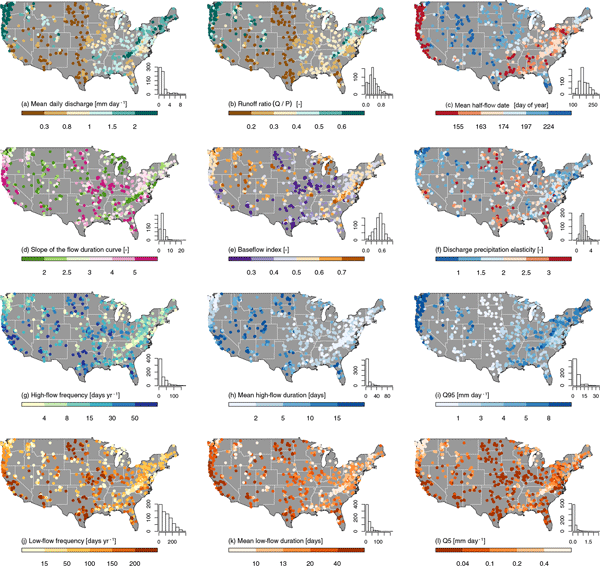

# 深度学习在水文领域中的应用研究

在前边的部分中我们已经学习了深度学习的一些神经网络以及一些常见算法，学到这里，我们可能会存在一些疑问，我们作为水文领域的研究者来说为什么要学习深度学习？深度学习在水文领域发挥了什么样的作用呢？那么相信阅读完本节后，这些问题就迎刃而解啦！

水文科学中一个长期存在的问题是如何使用一个模型或一组模型来提供大面积的空间连续水文模拟，其核心挑战是如何将水文信息从一个区域推断到另一个区域。通常来说,了解不同地区之间的异同一般是通过使用辅助数据（如突土壤地图，遥感等）来完成的，现如今，我们可以使用大样本水文数据集开发一个区域降雨径流模型，并对大量流域进行准确的流量估计。深度学习水文建模的两大基础是数据和模型，在数据方面，大样本水文研究推动了大样本水文数据集的构建，这些大样本水文数据集也成为了深度学习的研究基础，推动了深度学习水文建模的发展。那么本节主要是通过CAMELS数据集来描述大样本水文数据集在深度学习领域的应用，在学习之前，我们首先来了解一下CAMELS水文数据集的构成及作用。

## CAMELS数据集的简介

大样本水文研究为深度学习建模奠定了数据基础，相应的大样本水文数据集也在快速发展，CAMELS数据集已经成为众多水文研究的基础，其目的之一是为了在大样本条件下评估水文模型性能，其包含了水文模型常见的输入输出时间序列以及分析流域特征的气候地理等属性因素，非常适合深度学习水文建模的研究.CAMELS数据集基于一系列遥感数据产品等计算流域的地理气候属性数据，共包含了671个具有每日气象时间序列和径流数据的中小流域。

如果说水文数据没有较好的共享体系，那么流域水文数据通常难以大量获取，流域的水文建模通常只能基于小样本数据，而深度学习是数据依赖性模型，通常来说只有在大数据条件下才能充分发挥其有效挖掘其中规律的优点，另外，小样本数据集可能只包含个别流域，不具有普适性。所以说，在传统方法难以处理大规模水库影响流域水文建模问题等相关信息的大量时序数列难以获取的背景下，CAMELS数据集的构建大大推动了深度学习在水文领域的研究进展。

## 基于CAMELS数据集的相关研究成果

不少学者基于CAMELS数据集研究出了很多成果，本节中主要是以一篇论文为例，探讨通过应用CAMELS等大样本水文数据集的机器学习来学习局部流域的水文行为，该论文的链接为：<https://doi.org/10.5194/hess-23-5089-2019>

这篇文章主要是提出了一种使用长短期记忆网络（LSTM)的数据驱动方法，该论文证明出我们可以使用大样本水文数据集去开发区域降雨径流模型，此模型可以利用流域属性形式的可观测辅助数据对大量盆地进行准确的流量估计，并可以显示模型如何使用流域特征的信息来区分不同的降雨径流模型，该方法比较新颖，即通过使用气象时间序列和流域属性，在CAMELS数据集的531个盆地上训练单个LSTM模型，与传统的水文模型相比，该方法能够显著提高性能，其不仅明显优于区域校准的水文模型，而且比每个盆地单独校准的水文模型具有更良好的性能，此外，作者还提出了对标准LSTM架构的调整，即EA-LSTM，相比于传统的LSTM模型，该模型能够将流域特征与特定地点的动态联系起来，并从所有流域的综合数据中学习整体模型，除了能够提供与LSTM类似的性能外，也能够说明模型如何学习区分复杂的集水区特定行为的各个方面，最关键的一点是，EA-LSTM从大型流域学习单个模型，其方式明确包含了局部流域的相似性和差异，这对于我们的后续研究奠定了良好的基础。

本章的学习就到此结束啦，希望可以帮助到大家！
