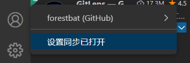
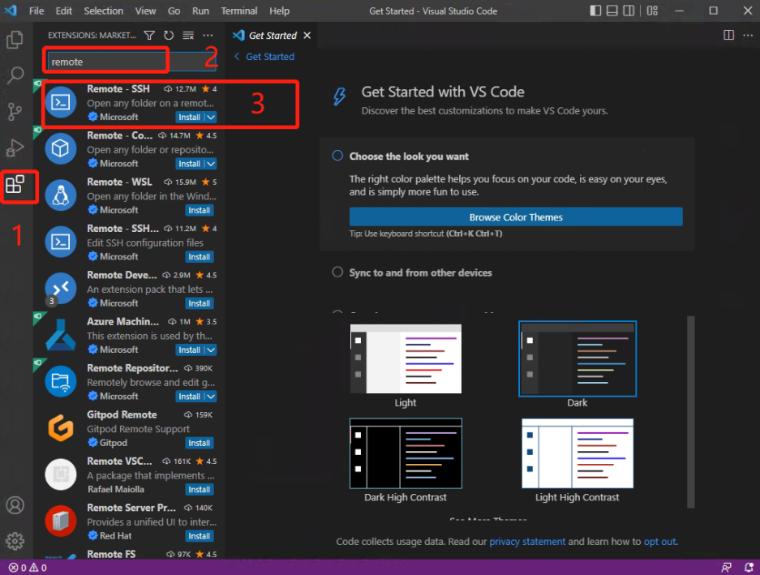
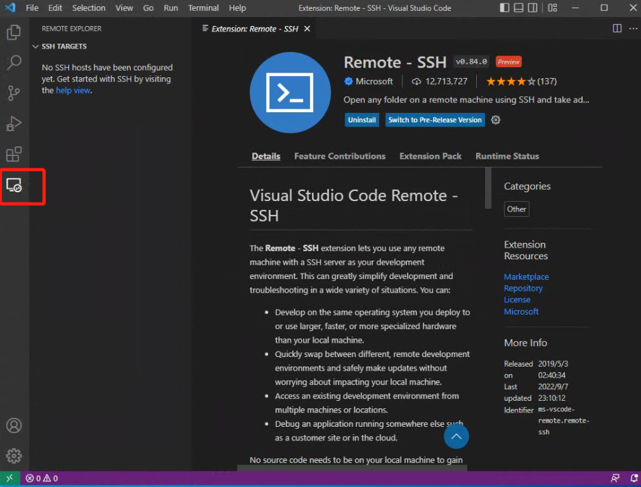
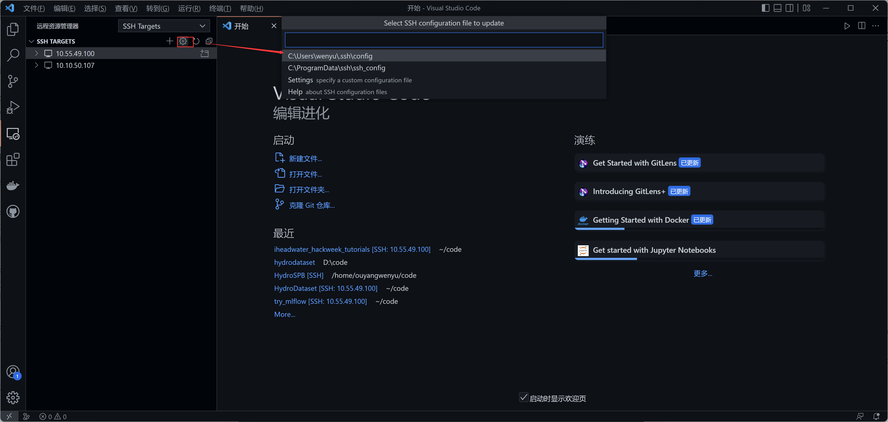
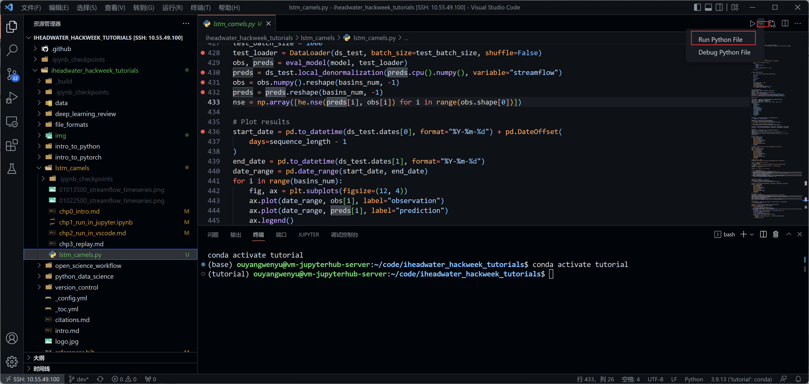

# 使用VSCode编写运行代码

上一节在jupyter上运行的代码最初就是在vscode上调试编写的，因为相比于jupyter，vscode这类IDE更适合编写、调试代码，jupyter还是更多地是帮助我们做数据分析，或者是快速验证一些程序。

本节就重点介绍，如何使用vscode连接平台计算资源，编辑运行代码。

当然你也可以直接在本地运行你的代码，你也可以试试你自己平常习惯用的其他IDE，这里选择vscode是因为vscode能通过插件支持多种语言，这样我们就不必针对每种语言再专门写文档介绍了。

以下步骤第一次做会觉得有点麻烦，但是它是一次性的，以后带给你的方便会让你觉得值得的。

## 下载安装配置VSCode

首先在本地设置好vscode，你就能在本地用它了，不过本节重点讨论远程连接到平台。

### 本地下载安装vscode

首先，要在你自己的电脑（本地）上下载安装vscode软件，直接在[vscode官网](https://code.visualstudio.com/)下载，然后一路默认安装即可。


### 登录以同步设置

打开vscode，点击vscode窗口左下角的账户或设置按钮，选择“登录以同步设置”，这样后面你的设置就可以在多个地方同步，而不用换一台电脑就要重新配置一遍。


vscode上方会弹窗让用户选择采用Microsoft还是Github登录，若选前者，浏览器会跳出MS账户登录页面，若选后者，vscode会在浏览器中打开一个GitHub校验标签页，不必管它，连接成功后浏览器会自动跳回vscode。

如果你跟着前面的教程做到这里，那你应该注册过GitHub账号了，所以直接用它就好了。

此时设置同步便已启用：



你什么都不用做，下次换台电脑再安装vscode，登录后，会自动同步好你的所有配置。

### 安装Python相关插件

插件窗口下搜索 Python，排名第一的插件下载下来：


类似的操作，建议把下面这些插件都安装好：

- [汉化](https://marketplace.visualstudio.com/items?itemName=MS-CEINTL.vscode-language-pack-zh-hans)
- [智能补全](https://marketplace.visualstudio.com/items?itemName=VisualStudioExptTeam.vscodeintellicode)
- [Markdown](https://marketplace.visualstudio.com/items?itemName=yzhang.markdown-all-in-one)
- [Python代码检查错误](https://marketplace.visualstudio.com/items?itemName=ms-python.vscode-pylance)
- [Python代码注释](https://marketplace.visualstudio.com/items?itemName=njpwerner.autodocstring)

## 使用VSCode连接平台

下面看看远程连接平台。

### 安装远程连接插件

选择左侧Extensions 选项卡，在输入框搜索 remote ，选择安装Remote-SSH插件。



安装完成之后会在左侧新增一个选项卡Remote Explorer，如下图所示



### 添加远程服务器连接配置

点击该选项卡，会进入SSH TARGETS的添加，如下图所示，点击设置按钮，vscode会弹框询问选择哪个配置文件，一般只需选择最上面的文件（C:\Users\你的用户名\.ssh\config）：



进入配置文件后，复制粘贴如下文本：

```Plain Text
Host jupyterhub.waterism.com
  HostName jupyterhub.waterism.com
  IdentityFile ~/.ssh/id_rsa
  PreferredAuthentications publickey
  User 你在jupyter上注册的账号名
```

然后保存即可。

### 连接平台

如无意外，SSH Targets中会生成一个jupyterhub.waterism.com项（和你粘贴进去的Host一致），鼠标右键点击此项，选择在“当前窗口”或者“新建窗口”打开，两个选项选择任意一个即可。


remote ssh插件便会为你自动连上jupyter服务器，连接成功后，窗口左下角远程小窗口会出现jupyterhub.waterism.com字样：


此刻便已连接成功。

选择“文件”-> “打开文件夹”：


选择一个文件夹打开即可。

:::{note}
注意：若用户在外网连接内部服务器失败，报错Time out，请注意是否已经打开研发中心的VPN。
:::

注意一下vscode插件窗口，尤其是SSH远程服务器部分：


和“本地-已安装”是分开的两个部分。

如果刚刚本地安装了很多插件，这时候远程也会提示你安装相同的插件，安装即可。

## 运行代码

如果你之前跟着一起实践了git和github部分的操作，那么这里你应该已经有一些代码在服务器上了。

这里以本教程的代码为例，如果你已经在服务器上下载过相关代码了，那直接打开 iheadwater_hackweek_tutorials 代码文件夹即可

然后，选择Python的解释器：按快捷键 “ctrl+shift+p”，输入 python: select interpreter，选择它，然后选择 平台上已经提供的 tutorial 环境，就为iheadwater_hackweek_tutorials 配置好运行环境了。

现在我们就可以运行代码了。比如打开iheadwater_hackweek_tutorials/lstm_camels/lstm_camels.py 文件，直接运行即可：



你会得到和上一节jupyter上运行同样的结果。
