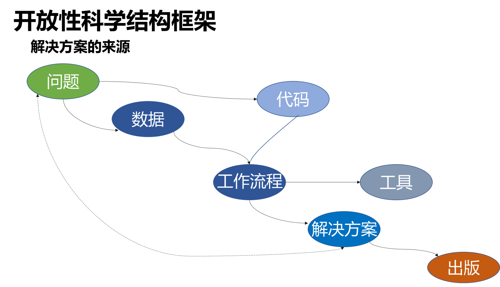

# 1.1 可复现科研的一般工作流程

尽管我们有很多数据是不能公开的，但是不能公开的数据我们就没法拿来复现相关成果，并当作我们公开学习讨论的资源，所以我们这里还是重点从**开放科学研究**方面来讨论可复现科研的一般工作流程。至于那些只能小范围内传播的不可公开数据，以及需要保密地内部研发工作，如果我们在小范围内同样遵循本章接下来要讨论的内容涉及的原则和方法，那也是有利于我们的科研或者面向实际生产的研发工作的。

网上有[资料](https://openscience.org/what-exactly-is-open-science/)很详细地展开介绍了Open Science是什么，感兴趣地可以去看看，这里综合其他资料（{cite}`open_science_2021`）简单概括下，开放主要包括以下几个方面：

- 数据公开
- 方法公开
- 涉及的代码开源
- 成果公开发表

简而言之就是发表论文涉及的那些东西都是开放的，这样任何人（包括他人和未来的自己）都可以理解和复制分析的步骤，应用于相同（或者新的）数据上，得到一致的结果。这样就能很好地符合科研上非常重要的可复现原则。

科研工作一般整体框架如图所示，包括提出问题，收集数据，编写代码分析处理数据，得到结果，最后发表。提出问题、发表论文等就是科研具体的内容了，是大家日常最主要的工作之一，本教程里我们重点了解工具、数据、代码等内容，以及通过它们怎么实现中间整个实践过程的工作流的。

另外，注意以下方面能帮助我们更好地完成整个工作流并使相应成果能流传下去。

**尽可能地使用编程自动化工作流**

许多人习惯在具有图形用户界面（GUI）的Microsoft Excel（用于处理表格）或ArcGIS（用于空间数据）等工具中处理数据。当然，GUI有很多优点，例如我们更容易上手，它们的可视化界面使得初学者的学习曲线不那么陡峭，在一些情况下也的确是最优选择，例如我们想快速可视化一些数据。但是，随着使用的数据越来越复杂，我们经常会遇到基于这些GUI工具无法简单处理的情况，通常需要手动实现一系列步骤，或者构建宏或小型的自动化脚本，这会使工作流难以重现。另外，如上一节所说，某些工具（如ArcGIS）需要付费许可证，这有局限性，并且对于在云端远程环境中包含工作流是不利的，不利于大家协同工作。

**优雅地组织文件**

良好的目录和文件名能帮助我们快速找到所需的内容，还可以提示我们文件或目录包含的内容及其用途，帮助其他人了解这些内容。

**使用符合FAIR原则的数据**

尽管由于各种原因，我们研究中会涉及很多不可公开的数据，但尽量确保项目中使用的数据符合FAIR原则{cite}`wilkinson_fair_2016`，并且制作有关于如何访问它们文档，以便使它们可查找，可访问和可重用等，对大家的研究和团队研发工作还是至关重要的。

**保护原始数据**

不要修改（或覆盖）原始数据。将数据输出与输入分开，以便可以根据需要轻松地重新运行工作流。

**使用版本控制工具**

版本控制能帮助我们管理和跟踪对文件的更改，最常用的工具是Git。如果可以公开共享代码，请实现版本控制，然后在云上发布代码和工作流，也有许多工具可以做到这一点，比如GitHub等。

**记录工作流程**

写文档来解释工作流中的步骤是必要的。可以使用Jupyter Notebooks等工具来构建包含Markdown格式的文本，文本叙述中穿插代码来提供对工作流的解释。这种交互的，穿插文字和代码的方式是科研编程的一种很友好方式。

文档还可以包括有关编程函数的标准化代码文档，以及描述整个科研项目工作流，目录结构，数据等更宏观内容的README文件。

**设计可轻松重建的工作流程**

可以通过以下方式设计可由其他人轻松重新创建和复制的工作流：

- 在代码文件的顶部列出运行工作流所需的所有包和依赖项
- 将代码按模块组织，并用注释解释代码。
- 使用平台提供的代码环境创建易重用的环境

我们这整个教程就是为了帮助大家学习如何构架良好的科研代码体系，遵循上面提到的原则，现在你不必过于纠结这些原则中提到的内容，简单认识，知道有这些东西即可，后面我们最终复现一个科研工作时你就会比较好地认识这些内容了。

接下来就让我们先看看常用的工具吧。
