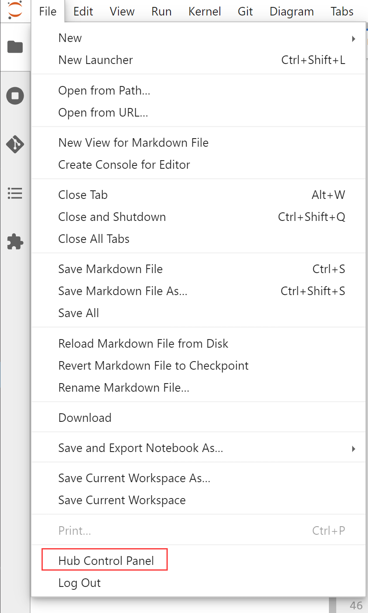
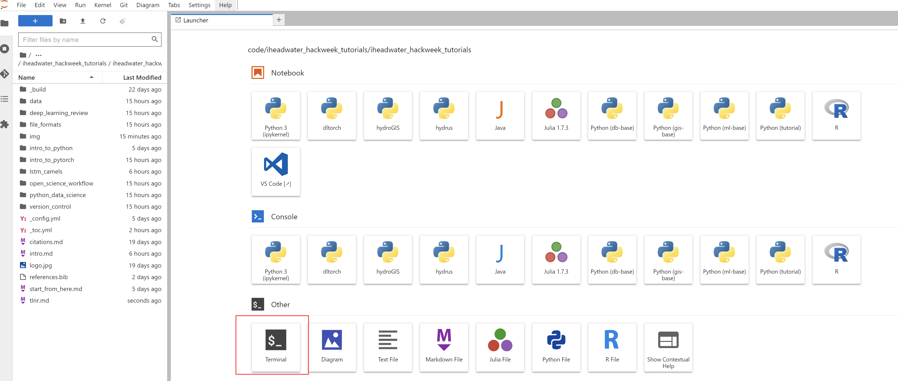
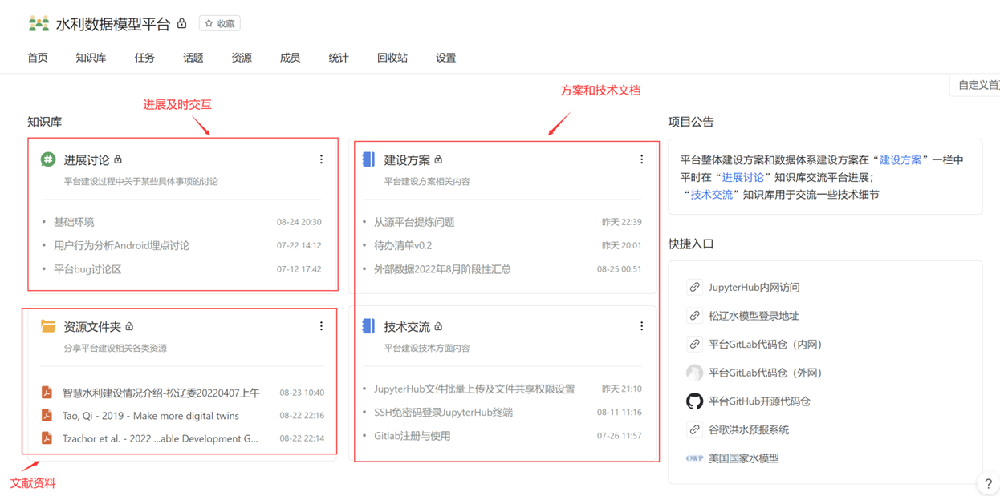

# TLDR页

整个内容以科研编程入门为主线串联，更加适合新生入学学习，内容有点多，Too Long; Didn’t Read（TLDR），所以这里我们提供一个手册页，主要以串联日常使用平台需要的操作为主，具体内容会有链接提供。

手册主要包括以下几个部分：

1. **连接研发中心内网**：研发中心VPN或本地/远程连接到在研发中心/411教研室的计算机
2. **平台JupyterHub账号注册与登录**：团队搭建了[Jupyterhub](http://jupyterhub.waterism.com:666/)
3. **登录后使用JupyterLab**：编写markdown与jupyter notebook
4. **与他人协作**：使用Git、GitHub
5. **使用集成开发环境工具**：用VSCode连接平台使用或贡献代码资源
6. **技术研发类项目的数字化管理**：联合使用各类工具，与大家分享各种资源

## 1.连接研发中心内网

有电脑在研发中心或者411的同志就比较容易了，不需要做任何操作，可以跳过这一步。

其他教研室因为各方面原因，暂时还没有或不方便开通内网连接，所以推荐大家在本地电脑安装使用研发中心VPN。

VPN的安装使用方式请参考[这里](https://dlut-water.yuque.com/docs/share/4cab7471-0be7-4570-a51a-8936b1c612d1?#)

## 2.平台JupyterHub账号注册与登录

注册与登录和一般网站的没有区别，当你连接入内网后，在浏览器中输入： http://jupyterhub.waterism.com:666/ 就能访问。

如果你需要注册和登录的详细介绍请参考[这里](https://iheadwater.github.io/iheadwater_hackweek_tutorials/start_from_here.html)

## 3.使用JupyterLab

关于JupyterLab与JupyterHub还有Jupyter Notebook之间的联系，可以参考[这里](https://iheadwater.github.io/iheadwater_hackweek_tutorials/chp1_open_science_workflow/chp1.4_jupyter.html)，简而言之，我们不用管Hub，我们用的是Lab，写的是Notebook

写Notebook的时候主要写代码和文字：

- 代码主要是Python，另外平台还添加了对R、Julia和Java的支持，但是对Java的支持并不友好，所以还是推荐大家使用前面几种语言编写脚本程序。推荐Python或者R等的原因，主要是因为它们更加简单，且开源资源更丰富，如果你会使用Java编写一些计算程序，那学习使用Python或R只有很少的时间成本，并且是值得的，因为收益会更大。不推荐Java的原因还有它更加适合于软件开发，尤其是部署运行各类软件系统的程序，科学工程计算中使用它的相对还是比较少。如果你对计算效率有很高的要求，那建议用C/C++或者Julia来编写相关程序，前者仍然是最常见的高效率编程语言，后者是近10年来发展起来的，学习成本和Python相当，运算效率还很高，已被地学相关领域广泛使用。教程提供了Python基础的介绍，详见[这里](https://iheadwater.github.io/iheadwater_hackweek_tutorials/chp4_intro_to_python/chp4.0_intro.html)
- 文字主要通过markdown来编写，和在后缀名为.md的文件中编写方式一样。markdown能够帮助我们在使用少量格式标记的情况下，就能编写格式漂亮的文档，从而让我们专注于制作更优质的内容，功能虽不如word强大，但是已经足够我们日常使用，且非常轻量级，易于在网页端和其他人分享你写的内容。关于markdown的写法以及如何在jupyterlab上写markdown文件请点击[这里](https://iheadwater.github.io/iheadwater_hackweek_tutorials/chp1_open_science_workflow/chp1.4_jupyter.html)查看。

使用JupyterLab的一个完整示例可以参考[这个例子](https://iheadwater.github.io/iheadwater_hackweek_tutorials/chp8_lstm_camels/chp8.1_run_in_jupyter.html)，这是一个深度学习水文建模的简单实例。这里你可以在网页看看就行了，具体怎么运行它，完成下一步（4.与他人协作）的相关操作后就能学会。

另外，大家如果遇到问题，不是太好解决的，可以考虑保存好自己的文件后实施重启大法:



选中后，点击“stop my server”，然后再“start my server”，即可重启。


## 4.与他人协作

平台借助Git和GitHub/GitLab等工具实现团队协作。现代科技的进步越来越依赖团队协作，即便是前沿科研，对于我们这种工科类学科，单兵作战的局限性也越来越强，对于技术研发更是如此。

Git是一个版本控制工具，可以帮助我们有效地管理本地代码等文件的历史版本，通过GitHub或GitLab这类Git云软件服务，结合本地Git的使用，能够有效地支持多人协作。关于它们的介绍，可以参考[这里](https://iheadwater.github.io/iheadwater_hackweek_tutorials/chp3_version_control/chp3.0_introduction.html)。

平台上已经预置了Git，本地软件就不必再安装了（如果你想在自己电脑上也使用git，Windows下默认是没有的，所以你需要去[git官网](https://git-scm.com/downloads)下载git软件并安装，安装时候一路默认即可），连接到平台后可以直接使用。

尽管我们在平台上也有Git插件，能支持大家可视化操作Git（如下图所示），但是还是建议通过终端来使用Git，结合终端和可视化界面能帮助我们更灵活地使用计算机。


关于Linux终端的一些特别常用的命令介绍可以参考[这里](https://iheadwater.github.io/iheadwater_hackweek_tutorials/chp1_open_science_workflow/chp1.2.2_common.html)，通过简单练习，就能掌握一些基本使用方法来操作文件和文件夹以及使用一些软件。更多的Linux终端Bash指令，可以参考[这里](https://github.com/Idnan/bash-guide)。

平台上打开终端只需要如下图所示操作即可：



最开始常用的Git指令包括以下几个：

```Shell
# 下载代码，xxx表示git仓库的远程地址
git clone xxxxx
# git提交三连操作
git add -A
git commit -m "说明文字，说明本次提交的内容主要是什么"
git push
```

其他常用的git指令可以参考[这里](https://iheadwater.github.io/iheadwater_hackweek_tutorials/chp3_version_control/chp3.3_git_setup_and_commands.html)

Github的账号需要自己注册，去[GitHub官网](https://github.com/)注册，Github是国外的网站，所以访问不是特别稳定，但是它上面汇集了全球的开源资源，例如[awesome-open-hydrology](https://github.com/iHeadWater/awesome-open-hydrology)列出了很多和水文相关的开源资源，还是非常值得大家在上面学习的。

Github现在已经不支持HTTPS协议下对代码的推送（可以简单理解为不支持输入用户名密码的验证方式了），所以我们需要通过SSH来建立本地和Github远程上我们的代码仓之间的连接（可以简单理解为一种密钥配对的验证方式），我们需要首先在本地生成一对密钥，一个公钥一个私钥，公钥上传到GitHub上，私钥留在本地以配对验证。具体的方式需要大家参考[这里](https://iheadwater.github.io/iheadwater_hackweek_tutorials/chp3_version_control/chp3.2_setup_git.html)，**一定要照着操作一遍**，因为下一步使用VSCode连接平台的时候也会用到这对密钥。

因为Github访问不是特别稳定，且适合开源代码，大家可以自行想办法解决访问不稳定的问题（因为这个有点敏感，所以这里就不介绍了）。另外，为了内部研发项目，我们还搭建了内部的GitLab服务，GitLab和GitHub是一种东西，只不过这里我们用它来管理内部不便于公开的代码、数据等文件。因为GitLab目前只有一些内部项目代码，不方便让大家操作，所以这里暂时不进一步介绍，大家在熟练Git和Github的相关操作后，使用Gitlab是一样的。

掌握这些工具后，你应该就能在平台上fork并clone[本教程](https://github.com/iHeadWater/iheadwater_hackweek_tutorials)的代码，并运行其中

## 5.使用集成开发环境工具

Jupyter是很好的工具，但是也存在一些局限，典型地是它对代码调试不是特别友好，基本上只能在Notebook一个计算单元内调试，另外，对于比较成体系的代码项目，尤其是模型算法等的自主研发，使用它不是很好的选择，所以这里给出使用集成开发环境（IDE）工具来编写代码的方式，并重点介绍关于如何连接到平台的数据和计算资源方面的内容。

因为VSCode是一个以插件驱动各类编程语言开发环境的工具，能有效应对多语言，所以这里就以它为主介绍，这部分内容我们在[这里](https://iheadwater.github.io/iheadwater_hackweek_tutorials/chp8_lstm_camels/chp8.2_run_in_vscode.html)提供了详细的步骤介绍，大家可以跟着一步步执行。

## 6.技术研发类项目的数字化管理

本教程主要还是初级内容，但是内容已经不少了，所以就不再继续涉及过多关于技术研发所需的编程相关内容了，等大家熟练掌握初级内容后，并且觉得这种教程形式还不错，那么后续我们还会推出新的教程介绍更多研发用得到的内容。但是这里还是有必要提一提关于研发项目的数字化管理这个不是本质问题（本教程介绍的都是手段，不涉及本质问题）的问题的重要性。

要开展研发工作，信息化、交流、汇报的模式也应转型到真正研发队伍的模式，构建信息化开发的标准流程，文档、文献、代码全部升级管理，这些内容对形成团队力量特别重要。没有良好的数字化管理，有再好的想法和问题引领也很难有效率、有质量地实施，尤其对于技术类的项目内容。实质上，科研工作有了这些东西，开展也会更顺利。

这里推荐以[语雀](https://www.yuque.com/)为管理项目研发的主要交流阵地，我们常用的工具大多是即时通讯工具或者流程管理工具，例如微信和钉钉，它们并不是知识管理工具，实际上，和钉钉一样，语雀也是阿里自己开发使用的。因为项目研发的内容通常还是需要有所沉淀，即时通讯工具在这方面并不能很好地胜任，通过语雀我们能较好地管理我们的研发内容，例如：



资源的共享能让进入小组的同学快速地了解组内已有内容，不至于因为信息不足导致实力不能发挥。
