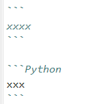

#  .md 与 .ipynb类型文件

## 1. 什么是Markdown

Markdown是一种标记语言，用于格式化文本文件。Markdown可以用来制作格式化良好的文档，包括PDF和网页。

在文档中使用Markdown格式化文本时，它类似于使用像Microsoft Word或Google Docs这样的文字处理工具中的格式化工具（如粗体、标题1、标题2）。然而，我们不是使用按钮来应用格式化，而是使用语法，如`**` 这个语法在markdown中对文本加粗 `**`或 `#` 这里是一个标题。

Markdown语法允许我们以多种方式格式化文本，如制作标题、加粗和斜体字、创建列表、添加链接、格式化数学符号和制作表格。这些选项使你能够以视觉上吸引人的和有组织的方式格式化文本，以展示我们的想法。

## .ipynb

Jupyter Notebook 创建的文件就是以`.ipynb`。i：云的含义，py：Python，nb：notebook。不管根据什么内核，例如Java，创建的notebook文件也是`.ipynb`，不会说是变成`.ijvnb`。上述讲述`.ipynb`单元格有三种模式可切换，其中只需了解两种即可——Markdown与Code。Code就是编写代码的模式，Markdown是本节重点内容。

我们既可以在jupyter文件(`.ipynb`)中创建 `markdown cell`编写`markdown`文本，也可以新建`Markdown`文档（后缀名为`.md`）

下面就看看如何编写markdown文档，即mardkown常用语法。用到时候查询即可。

### 1.1 斜体和粗体

```Python
*斜体*或_斜体_
**粗体**
***加粗斜体***
~~删除线~~
```

显示效果：

*斜体*或_斜体_
**粗体**
***加粗斜体***
~~删除线~~

### 1.2 分级标题

```Python
# 一级标题
## 二级标题
### 三级标题
#### 四级标题
##### 五级标题
###### 六级标题
```

显示效果：

# 一级标题
## 二级标题
### 三级标题
#### 四级标题
##### 五级标题
###### 六级标题

### 1.3 更改字体、大小、颜色

```Python
<font face="黑体">我是黑体字</font>  
<font face="微软雅黑">我是微软雅黑</font>  
<font face="STCAIYUN">我是华文彩云</font>  
<font color=red>我是红色</font>  
<font color=#008000>我是绿色</font>  
<font color=Blue>我是蓝色</font>  
<font size=5>我是尺寸</font>  
<font face="黑体" color=green size=5>我是黑体，绿色，尺寸为5</font>  
```

显示效果：

<font face="黑体">我是黑体字</font>  
<font face="微软雅黑">我是微软雅黑</font>  
<font face="STCAIYUN">我是华文彩云</font>  
<font color=red>我是红色</font>  
<font color=#008000>我是绿色</font>  
<font color=Blue>我是蓝色</font>  
<font size=5>我是尺寸</font>  
<font face="黑体" color=green size=5>我是黑体，绿色，尺寸为5</font>  

### 1.4 为文字添加背景色

由于 style 标签和标签的 style 属性不被支持，所以这里只能是借助 table, tr, td 等表格标签的 bgcolor 属性来实现背景色。故这里对于文字背景色的设置，只是将那一整行看作一个表格，更改了那个格子的背景色（bgcolor）。

```Python
<table><tr><td bgcolor=yellow>背景色yellow</td></tr></table> 
```

显示效果：

<table><tr><td bgcolor=yellow>背景色yellow</td></tr></table> 

### 1.5 换行

在一行的末尾添加两个或多个空格，然后按回车键,即可创建一个换行。或者用`<br>`实现换行。

```Python
This is the first line.  
And this is the second line.  
或者  
his is the first line. <br> And this is the second line.
```

显示效果：

This is the first line.  
And this is the second line.  
或者  
his is the first line. <br> And this is the second line.

### 1.6 超链接

Markdown 支持两种形式的链接语法： 行内式和参考式两种形式，行内式一般使用较多。

#### 1.6.1 行内式

语法说明 ：`[ ]`里写链接文字，`()`里写链接地址,`()`中的`“”“`中可以为链接指定title属性，title属性可加可不加。title属性的效果是鼠标悬停在链接上会出现指定的 title文字。`[链接文字](链接地址 “链接标题”)`这样的形式。链接地址与链接标题前有一个空格。

```Python
[WaterResources](https://github.com/waterDLut/WaterResources)

[WaterResources](https://github.com/waterDLut/WaterResources "WaterResources")
```

显示效果:

[WaterResources](https://github.com/waterDLut/WaterResources)

[WaterResources](https://github.com/waterDLut/WaterResources "WaterResources")

#### 1.6.2 参考式

参考式超链接一般用在学术论文上面，或者另一种情况，如果某一个链接在文章中多处使用，那么使用引用 的方式创建链接将非常好，它可以让你对链接进行统一的管理。

语法说明：参考式链接分为两部分，文中的写法 [链接文字][链接标记]，在文本的任意位置添加[链接标记]:链接地址 “链接标题”，链接地址与链接标题前有一个空格。

如果链接文字本身可以做为链接标记，你也可以写成[链接文字][ ]

[链接文字]：链接地址的形式，见代码的最后一行。

```Python
我经常浏览[hydrus][1]、[WaterResources][2]  
[WaterResources][2]是一个不错的[repo][]  

[1]:https://github.com/wangmengyun1998/hydrus "hydrus"   
[2]:https://github.com/waterDLut/WaterResources "WaterResources"  
[repo]:https://github.com/waterDLut/WaterResources  
```

显示结果 ：

我经常浏览[hydrus][1]、[WaterResources][2]  
[WaterResources][2]是一个不错的[repo][]  

[1]:https://github.com/wangmengyun1998/hydrus "hydrus"   
[2]:https://github.com/waterDLut/WaterResources "WaterResources"  
[repo]:https://github.com/waterDLut/WaterResources  

#### 1.6.3 自动链接

语法说明：Markdown 支持以比较简短的自动链接形式来处理网址和电子邮件信箱，只要是用<>包起来， Markdown 就会自动把它转成链接。一般网址的链接文字就和链接地址一样，例如：

```Python
<wmyun1998@163.com>
```

显示结果：

<wmyun1998@163.com>

### 1.7 列表

**使用 `*，+，- `表示无序列表**

```Python
- 无序列表项 一
 
* 无序列表项 一

+ 无序列表项 一
```

显示结果：

- 无序列表项 一
 
* 无序列表项 一

+ 无序列表项 一

**有序列表则使用数字接着一个英文句点**

```Python
1. 有序列表项 一
2. 有序列表项 二
3. 有序列表项 三
```

显示结果：

1. 有序列表项 一
2. 有序列表项 二
3. 有序列表项 三

**引用**

语法说明：引用需要在被引用的文本前加上`>`符号。

```Python
 >打开书本。  
 >打开电灯
```

显示结果：

 >打开书本。  
 >打开电灯

**引用的多层嵌套**

区块引用可以嵌套（例如：引用内的引用），只要根据层次加上不同数量的 `>` ：

```Python
>>>打开书本。  

>>打开电灯。

>阅读
```

显示效果：

>>>打开书本。  

>>打开电灯。

>阅读

### 1.8 任务列表

任务列表使您可以创建带有复选框的项目列表。在支持任务列表的Markdown应用程序中，复选框将显示在内容旁边。
要创建任务列表，请在任务列表项之前添加破折号`（-）`和方括号，并`[ ]`在其前面加上空格。要选择一个复选框，将x输在方括号`（[x]）` 。

```Python
- [x] Write the press release
- [ ] Update the website
- [ ] Contact the media
```

显示效果：

- [x] Write the press release
- [ ] Update the website
- [ ] Contact the media

### 1.9 插入图像

图片的创建方式与超链接相似，只需在`[]`前加上英文感叹号`!`即可。而且和超链接一样也有两种写法，行内式和参考式写法。

同时也可用相对路劲加载图片，[什么是相对路劲](https://www.cnblogs.com/jgg54335/p/14787211.html)

### 2.1 表格

语法说明：

- 不管是哪种方式，第一行为表头，第二行分隔表头和主体部分，第三行开始每一行为一个表格行。

- 列于列之间用管道符`|`隔开。原生方式的表格每一行的两边也要有管道符。

- 第二行还可以为不同的列指定对齐方向。默认为左对齐，在`-`右边加上`:`就右对齐。

```Python
学号|姓名|分数
-|-|-
小明|男|75
小红|女|79
小陆|男|92
```

显示效果：

学号|姓名|分数
-|-|-
小明|男|75
小红|女|79
小陆|男|92

为表格第二列指定方向：

```Python
产品|价格
-|-:
Leanote 高级账号|60元/年
Leanote 超级账号|120元/年
```

显示效果：

产品|价格
-|-:
Leanote 高级账号|60元/年
Leanote 超级账号|120元/年

### 2.2 代码

像输入代码或者涉及到其他标识符却不想标识符产生效果，可使用



其余的我们可参考[](https://github.com/iHeadWater/WaterResources/blob/master/tools/jupyterlab%26markdown.md)