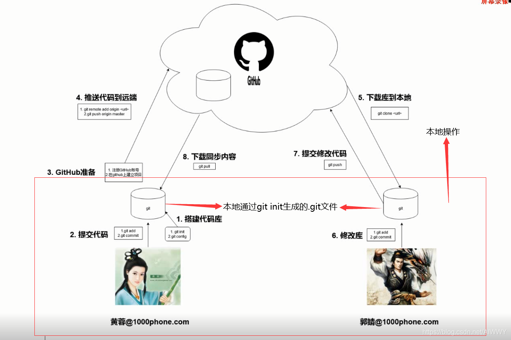

# 版本控制

之前简单提过，通过版本控制我们可以保存文件之前的版本，并可复原之前的版本。版本控制还支持我们对同一个文件进行多人协作。这一章我们将了解到git和GitHub.com，前者是一个版本控制工具，可以用它来跟踪文件的变化；后者是一个云仓库，可以用它来托管和与他人共享文件。

通过本章的学习，我们将学习如何使用git/GitHub.com实现版本控制，包括本地有修改对远程进行更新，远程有修改对本地进行更新，多人协作等。

