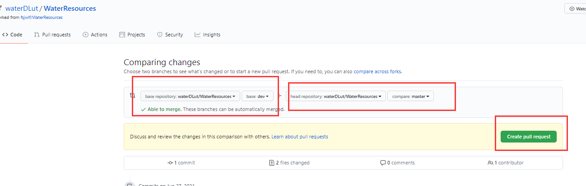

# 使用Git命令进行版本控制

## 1. Git和GitHub的版本控制工作流程

在此之前，已经学会了如何`fork` GitHub 仓库以复制其他用户的仓库，还学会了如何下载 GitHub 仓库的副本（即克隆）到本地电脑上。在这一节，我们将学习使用 git 来实现版本控制的三个重要步骤。

- `git add` 对已更改的文件进行版本控制跟踪
- `git commit` 改变文件来创建本地版本库的唯一快照
- `git push`这些改变的文件，从本地仓库的副本到云端（GitHub.com）。

## 2. git status 检查更改的状态

开始工作之前，**我们先克隆一个远程GitHub仓库到本地**。用**终端**导航到实践**git**的地方`$ cd practice-git-skillz`

```Python
git status
```

接下来，用文本编辑器打开 README.md 文件并做一个小改动。然后，运行`git status`命令，检查是否对文件进行了修改。

### 2.1 向版本控制添加和提交文件更改

用**git**来跟踪这个文件的变化:

1. 先用`git add`把改动添加到跟踪区（暂存区）
2. `git commit`对版本控制的更改

这两条命令构成了许多使用**git**进行版本控制的工作流程的主体。

- git add：在工作目录中获取一个修改过的文件，并将修改后的版本放在一个暂存区供审查。

- git commit：从暂存区获取所有内容，并为仓库的当前状态制作一个具有唯一标识符的永久快照。

修改过的文件会用`git add`暂存

## 3. 使用git add添加已更改的文件

在进行修改后，可以将单个文件或文件组添加到版本控制跟踪中。要添加**单个文件**，请运行以下命令：

```Python
git add file-name.extension
```

例如，要添加`README.md`文件，可以使用：

```Python
git add README.md
```

也可以同时添加**所有编辑过的文件**，使用：

```Python
git add .
```

## 4. 用git commit提交修改过的文件

当从暂存区移出，就可以运行`git commit`。`git commit` 命令需要一个提交信息，描述我们在该提交中所做的改动。

提交信息应该概述哪些地方发生了变化，以及为什么修改:

1. 帮助合作者和未来的自己了解哪些地方被修改了，为什么。
2. 让我们和合作者能够找到（必要时撤销）之前所做的修改。

没有提交大量的修改时，可以使用 `-m` 标志创建一个简短的单行提交信息，如下所示。

```Python
git commit -m "Update title and author name in homework for week 3"
```

每个提交都有一个唯一的标识符（SHA-1哈希值），并包括创建提交时对暂存区文件的所有修改（即用`git add`添加到暂存区的所有文件）

## 5. 推送修改后的文件到GitHub.com

到目前为止，只修改了仓库的本地副本并完成了对仓库的本地提交。要更新 **GitHub.com** 上的文件，需要把修改的文件**push(推送)** 到 **GitHub.com** 上的仓库。

可以用以下命令把改动推送到 **GitHub**:

```Python
git push origin main
```

**补充：** main是远程的（主）分支。将分支理解成一条平行直线，每个分支都会有版本控制的功能，团队协作中的每个人都可以创建一个属于自己的分支，然后在自己的分支上进行修改等事宜，而且版本控制还允许我们将分支进行融合等操作。

**下面我们就创建一个分支，并将分支推送到远程仓库（分支）下**

### 5.1 创建分支并推送到远程分支

输入以下命令查看当前分支：

```Python
git branch
```

**出现`*`表示当前处在该分支下**

新建一个本地分支：

```Python
git checkout -b  <你的分支名称>
```

比如常见的新建一个“开发”分支：`git checkout -b dev`

虽然建立分支，但可以看到 * 并没有出现在dev上面，输入：

```Python
git checkout dev
```

即可切换到dev上。命令`git checkout`是用于切换分支。然后把新建的本地分支push到远程服务器，远程分支与本地分支同名（当然可以随意起名）：

```Python
git push origin <你的分支名称>:<你的分支名称>
```

使用命令`git branch -a`查看所有分支，会看到remotes/origin/<你的分支名称> 这个远程分支，说明新建远程分支成功。

### 5.2 拉取远程分支

查看**远程**分支：

```Python
git branch -r
```

第一种方式：

```Python
git checkout -b 本地分支名x origin/远程分支名x  
```

使用该方式会在本地新建分支 x ，并自动切换到该本地分支 x 。采用此种方法建立的本地分支会和远程分支建立映射关系。

方式二：

```Python
git fetch origin 远程分支名x:本地分支名x  
```

使用该方式会在本地新建分支x，但是不会自动切换到该本地分支x，需要手动checkout。

采用此种方法建立的本地分支不会和远程分支建立映射关系。

你在 dev分支完成了你的部分，但是主分支还是原来那样，这个时候就需要把你的代码合并到主分支 main 上来，执行`git merge`就是合并分支用到的命令。

需注意，合并分为两步！！！

1. 切换到 main 分支，如果你已经在了就不用切换了;
2. 执行 `git merge dev` ，意思就是把 dev 分支的代码合并过来，不出意外，这个时候 dev分支的代码就顺利合并到 main 分支来了。

有添加就有删除，假如分支新建错了，或者dev分支的代码已经顺利合并到 master 分支来了，那么 dev 分支没用了，用 `git branch -d` 删除。删除分支dev 的语句为 `git branch -d dev` 。

### 5.3 pull request

我们在之前已经介绍过如何创建分支并且推送到远程，那么现在自己的github上已经有了创建的dev分支，这个分支将是随后发起 Pull Request 时要用到的源分支。

点击项目简介下的 **Pull Request** 按钮


再点击**New Pull Request**


点击**Create Pull Request**即可，自己的仓库默认设置为源仓库（head fork）、询问指定源分支（compare）、目标仓库（base fork）和目标分支（base）



此时对方就会在在他自己的 GitHub 仓库下的**Pull Request**选项卡中看到所有的**Pull Request**。点击 **Pull Request** 会显示这个**Pull Request**的简介、dev 分支的提交历史，以及包含的更改。

如果对方认为 dev 分支已经可以合并了，他只需点击 **Merge Pull Request**按钮来通过这个 **Pull Request**，将dev分支并入他的 **main** 分支。

最后，对方接受了这些修改，将 dev 分支并入了 main 分支，关闭了这个**Pull Request**。功能现在已经整合到了项目中，其他在 main 分支上工作的开发者可以使用标准的 **git pull** 命令将这些修改拉取到自己的本地仓库。

### 5.4 fork后同步源仓库新更新的内容

fork了别人的repo，一段时间后，别人更新了，想要同步过来最新的内容，应该怎么做？

首先，查看远程状态:

```Python
git remote -v
```

确定一个将被同步给 fork 远程的上游仓库:

```Python
git remote add upstream git@github.com:waterDLut/WaterResources.git
```

然后再次查看远程状态，已经可以看到upstream的信息了。

从上游仓库 fetch 分支：

```Python
git fetch upstream
```

转换到main(或者master)分支

```Python
git checkout main
```

合并远程分支：

```Python
git merge upstream/main
# 或者
git rebase upstream/main
```

如果本地没有更改，那git就直接自动执行一个fast-forward，如果有更改，就手动调整一下有冲突的地方，然后commit即可。

最后push到自己的origin上即可。

```Python
git push
```

### 5.5 查看历史版本

使用命令：

```Python
git log
```

可以查看历史提交记录。

使用

```Python
git checkout xxx（某个历史版本的哈希值，即git log下显示的每次commit对应的一串数字字母）
```

即可回到xxx的那个版本。

## 6. 从GitHub.com上拉出修改过的文件到克隆Repo上

运行`git clone`会将 git repo的完整副本从github.com复制到本地计算机。它包括所有的.git历史信息，我们将需要这些信息来跟踪repo的变化。**我们只需要运行一次git clone**。运行完git clone后，可以用`git pull`来更新 repo。

`git add`、`git commit`和`git push`是将本地的修改推送到远程，`git pull`从远程库中获取某个分支的更新，再与本地指定的分支进行自动merge

首先查看我们处于哪个分支，因为我们可能会有许多分支，而只需对特定分支进行更新。

```Python
git branch
```

再查看一下远程分支：

```Python
git branch -r
```

运行`git pull`

```Python
git pull <远程库名> <远程分支名>:<本地分支名>
```

比如，取回远程库中的dev分支，与本地的develop分支进行merge，要写成：

```Python
git pull origin develop:develop
```

**如果是要与本地当前分支merge，则冒号后面的<本地分支名>可以不写。**

通常，git会将本地库分支与远程分支之间建立一种追踪关系。比如，在git clone的时候，所有本地分支默认与远程库的同名分支建立追踪关系。也就是说，本地的main分支自动追踪origin/main分支。因此，如果当前处于本地dev分支上，并且本地dev分支与远程的dev分支有追踪关系，那么远程的分支名可以省略：

```Python
git pull origin
```

## 7. 用.gitignore文件告诉 Git 忽略文件

有时在git repo中有些文件是不想被追踪的。例如：

- _DS_STORE or
- .ipynb checkpoint files.

其他时候，仓库里有敏感的文件，永远不想用**git**来追踪，比如API凭证或其他包含个人信息的文件。可以把任何文件类型或名称添加到`.gitignore`文件中，这样**git**就不会追踪它们。这意味着，当运行`git add`或`git status`时，它将不会追踪任何列在`.gitignore`文件中的文件。因此，这些文件将永远不会被添加到 **GitHub.com** 上。

假设有一个名为 `social-security.txt` 的文件，其中包含敏感信息。可以将该文件添加到一个 **.gitignore**文件中。如果仓库中还没有 **.gitignore**文件，可以用文本手动创建，或者使用下面的`bash`命令。

在文本编辑器中打开这个`.gitignore`文件，添加**git**忽略的文件名（不需要其他信息），比如说:`social-security.txt`

任何列在`.gitignore`文件中的文件都会被**git**忽略。也可以通过在`gitignore`文件中添加目录名称来告诉**git**忽略目录（比如忽略一个名为`private-directory`的目录）