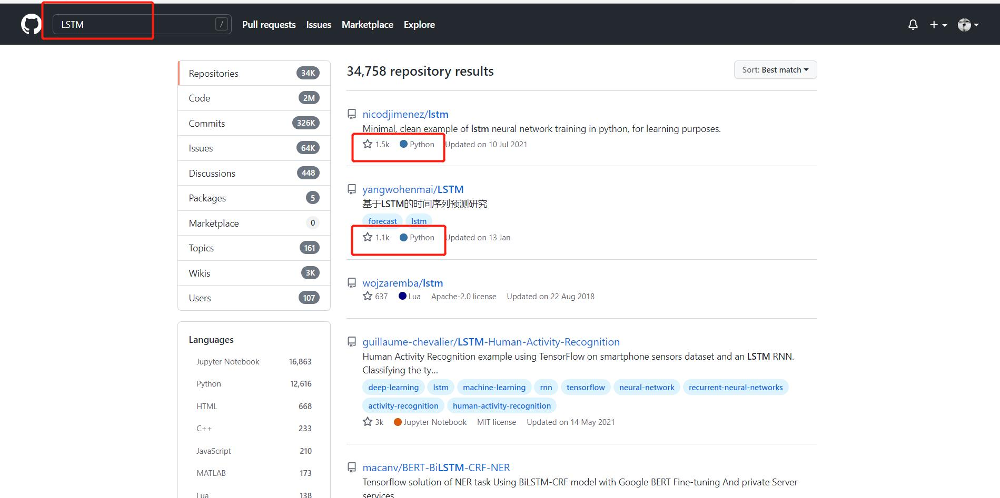
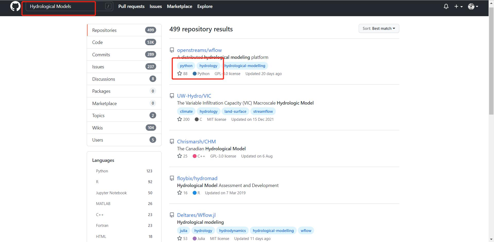
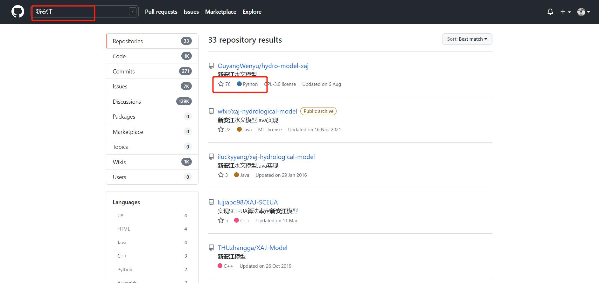

# 本章简介

Python 是一个高层次的结合了解释性、编译性、互动性和面向对象的脚本语言。Python 的设计具有很强的可读性，相比其他语言经常使用英文关键字，其他语言的一些标点符号，它具有比其他语言更有特色语法结构。因此目前Python用户量非常多，稳居语言的第一位。

本章我们将开始学习使用Python的基本概念，学习如何开始用Python处理数据，包括创建和处理变量、列表、函数与条件语句等