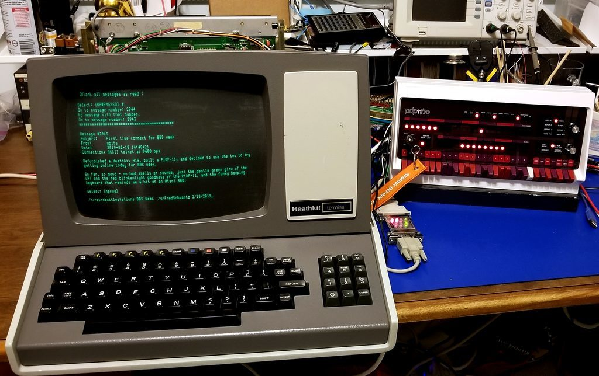

# 第一页图

# 从这里开始

1. 了解开放式、可复现科学并学会使用一般工作流中用到的编程相关工具。
2. 认识我们日常科研经常处理的数据文件
3. 掌握版本控制概念与操作方法
4. 掌握Python基础
5. 练习Python数据分析
6. 初识深度学习（水文）综述
7. 使用深度学习工具Pytorch
8. 复现基于CAMELS数据集和LSTM模型的研究论文

# 编程概念及相关工具

我们将需要在平台上复现科研成果，以达到科学性、可重复性、可推广的目标，真正为科研添砖加瓦。其中良好的编程能力是必不可少的，本教程主要目的就是带大家入门编程与掌握编程工具

本章我们首先初步认识用于开放式、可复现科研的一般工作流程并掌握这一过程中常用的一些工具，主要包括计算机的终端、编程编辑器和版本控制工具等，看完本章我们将：

1. 知道开放式可复现科研一般工作流是什么样的
2. 会在终端中运行命令以处理计算机上的文件和目录。
3. 能简单使用jupyterhub提供的工具
4. 初步了解版本控制工具Git和相关的Github

# 1.1 开放可复现科研的一般工作流程

## 设计可轻松重建的工作流程

可以通过以下方式设计可由其他人轻松重新创建和复制的工作流：

- 在代码文件的顶部列出运行工作流所需的所有包和依赖项
- 将代码按模块组织，并用注释解释代码。
- 使用平台提供的代码环境创建易重用的环境

我们这个教程就是为了帮助大家，学习如何构架良好的科研代码体系，最终可自行实现**用CAMLES数据集数据在LSTM模型上得出相应结果**（LSTM是一个深度学习的代表性模型，深度学习是机器学习的子集，简单理解，就是用计算机学习现有数据的特征、规律实现特定目标，例如预测未来数据。CAMELS数据集简单理解就是存储数据的），接下来就让我们先看看常用的工具吧。

# 2.2 管理目录和文件的Bash命令

在前面关于终端会话的部分中，我们了解到终端会显示一个提示，提示Bash正在等待输入：`$ bash`

回想一下，根据计算机设置，会看到不同的字符作为提示或提示之前的附加信息，例如在计算机文件结构中的当前位置（即当前的工作目录）。

**注意:** 输入命令时，请勿键入美元符号（或其他字符提示符），只键入它后面的命令即可。

下面是一些常用的`bash`命令，让我们来操作下吧。

## 1. 打印当前工作目录 ( pwd )

首要要明确，当前的工作目录是执行命令的目录。它通常打印为目录的完整路径（意味着可以看到父目录）。

要打印当前工作目录的名称，键入命令 pwd : `$ pwd`

由于这是Bash在此会话中执行的第一个命令，因此结果pwd是主目录的完整路径。主目录是每次启动新Bash会话时将位于的默认目录。

Windows 用户：请注意，Terminal使用正斜杠 (/) 来指示路径中的目录。这与使用反斜杠 (\) 指示路径中的目录的 Windows 文件资源管理器不同。

## 2. 更改当前工作目录 (cd)

通常，想要更改当前工作目录，以便可以访问不同的子目录和文件。

要更改目录，请使用`cd`后跟目录名称的命令（例如`cd downloads`）。然后，可以再次打印当前工作目录以检查新路径。

可以使用`cd ..`命令返回任何当前目录的父目录，因为当前工作目录的完整路径可以被Bash.

也可以随时使用`cd ~`命令（称为波浪号的字符）返回主目录

## 3.创建新目录 (mkdir)

创建新目录的第一步是导航到希望成为该新目录的父目录的目录

然后，使用命令`mkdir`后跟要为新目录命名的名称（例如`mkdir directory-name`）

**注意:**`mkdir`命令没有输出。

## 4. 打印文件和子目录列表 (ls)

要查看**当前**工作目录中所有**子目录**和**文件**的列表，请使用`ls`命令。

## 5. 删除文件 (rm)

要删除特定文件，可以使用`rm`命令后跟要删除的文件的名称（例如`rm filename`）

## 6.删除目录 (rm -r)

要删除一个目录及其包含的所有子目录和文件，请导航到其父目录，然后使用`rm -r`命令后跟要删除的目录的名称（例如`rm -r directory-name`）

`rm`代表删除，而有`-r`必须告诉`Bash`它需要通过父目录中所有文件和子目录的列表递归（或重复）命令。

## 7. 复制文件 (cp)

还可以使用`cp`命令将特定文件复制到新目录，`cp`后跟要复制的文件的名称以及要将文件复制到的目录的名称（例如`cp filename directory-name`）

请注意，文件的原始副本仍保留在原始目录中

## 8. 复制目录及其内容 (cp -r)

同样，可以将整个目录复制到另一个目录，使用`cp -r`后跟要复制的目录名称和要复制目录的目录名称（例如`cp -r directory-name-1 directory-name-2`）。

与`rm -r`类似，`cp -r`有必要`Bash`通过父目录中所有文件和子目录的列表来告诉它需要递归（或重复）命令。

## 9. 使用单个命令 (touch)创建新文件

可以使用单个`touch`命令（例如`touch file-name.txt`）创建一个新的空文件。此命令最初是为了管理文件的时间戳而创建的。但是，如果文件尚不存在，则该命令将生成该文件。

这是一种以编程方式快速创建新的空文件的非常有用的方法，该文件可以在以后填充。

## 10. 使用vim编辑文件