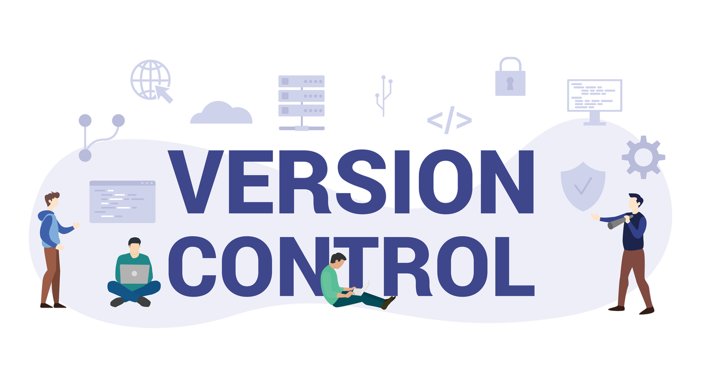
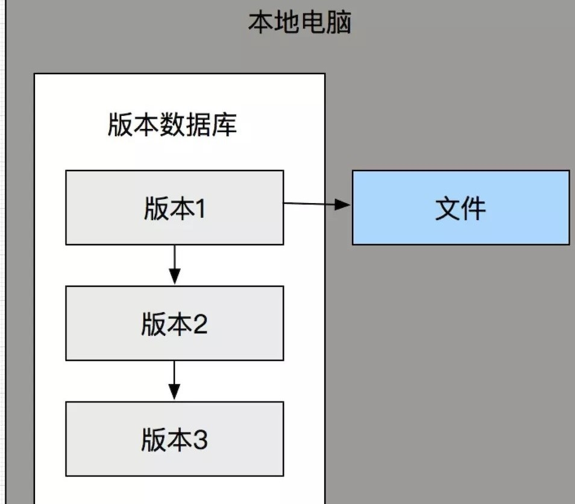
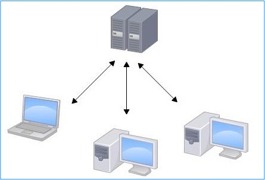
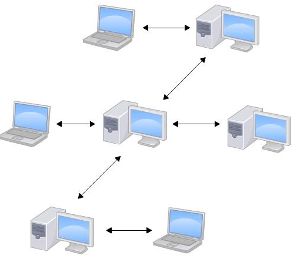

# 入门——关于版本控制

在前面的章节中，我们已经对Git及Github进行了一些简单介绍，在本章中，我们先从介绍版本控制工具的背景知识开始，然后讲解如何在我们的系统上运行Git及Github，最后是关于如何利用 Git及GitHub开展工作。相信在经过本章的学习后，我们可以掌握并熟练运用Git这个版本控制工具以及代码托管云服务网站GitHub，下面就让我们一起来学习吧！

## 关于版本控制

当我们刚刚接触版本控制系统时，相信大多数人内心都会存在疑问：什么是版本控制？为什么要关心版本控制？为什么版本控制很重要？在前面的章节中我们已经提到过，版本控制是一个系统，它可以通过记录一个文件或一组文件随时间的变化以便我们以后可以调用特定版本。常见的三种类型的版本控制分别是：

- 本地版本控制系统

- 集中式版本控制系统

- 分布式版本控制系统

下面将对其进行详细的介绍。

### 本地版本控制系统

许多人选择的版本控制方法是将文件复制到另一个目录。这种方法很常见，因为它非常简单，但也非常容易出错，有时候会一不小心会写错文件或者覆盖文件。为了解决这个问题，程序员很久以前就开发了本地 VCS，它有一个简单的数据库，可以将文件的所有更改保持在版本控制之下。

这是一种非常常见且易于使用的版本控制系统。但是这种方法很容易出错和受到攻击，因为文件存储在你的本地系统中，这意味着你可能会丢失系统文件。

### 集中式版本控制系统

集中化的版本控制系统（Centralized Version Control Systems，简称 CVCS）有一个单一的集中管理的服务器，保存所有文件的修订版本，而协同工作的人们都通过客户端连到这台服务器，取出最新的文件或者提交更新。 

这种做法带来了许多好处，特别是相较于老式的本地 VCS 来说。 通过CVCS,我们每个人都可以看到项目中的其他人正在做些什么。 而管理员也可以轻松掌控每个开发者的权限，并且管理一个 CVCS 要远比在各个客户端上维护本地数据库来得轻松容易。

但是，这么做最大的缺点就是中央服务器的单点故障。 如果宕机一小时，那么在这一小时内，谁都无法提交更新，也就无法协同工作。 如果中心数据库所在的磁盘发生损坏，又没有做相应的备份，毫无疑问，我们将丢失所有数据，当然这也包括项目的整个变更历史。本地版本控制系统也存在类似问题，只要整个项目的历史记录被保存在单一位置，那么就存在丢失所有历史更新记录的风险。

### 分布式版本控制系统

和集中式版本控制系统相比，分布式版本控制系统中（（Distributed Version Control System，简称 DVCS）的安全性要高很多，因为我们每个人的电脑里都有完整的版本库，当团队中的某一个人的电脑坏掉了，随便从其他人那里复制一个就可以了，而集中式版本控制系统的中央服务器要是出了问题，所有人都不得不停工。这么一来，任何一处协同工作使用的服务器发生故障时，事后都可以用本地仓库恢复。 因为每一次的克隆操作，实际上都是一次对代码仓库的完整备份。

总而言之，在 DVCS 中，所有开发人员都拥有服务器中所有数据的完整备份。这意味着无论何时服务器关闭或出现故障，我们仍然可以处理我们的项目，比如说我们可以将仓库复制或备份到服务器以恢复它们。

读到这里，相信我们对于版本控制有了更深的理解，但是可能内心仍然存在一些疑问，比如说Git如何支持版本控制呢？如何使用GitHub呢？如何利用GitHub进行多人协作呢？让我们带着这些疑问接着向下看吧！在学习之前，请先记得下载相应的软件哦，相应的下载链接在前面的章节已经展示过了，这里不再赘述。