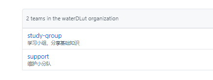
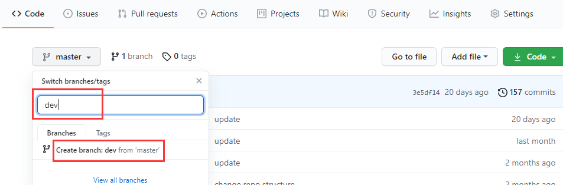
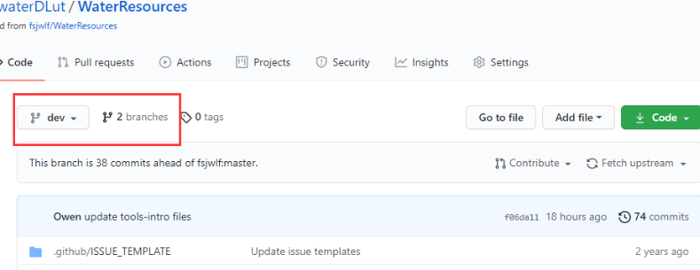
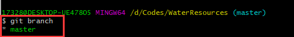
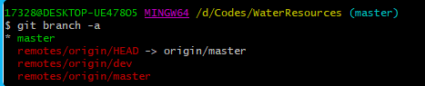
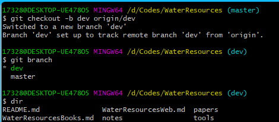
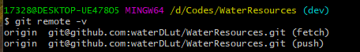
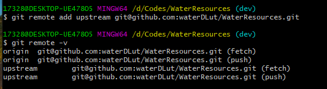
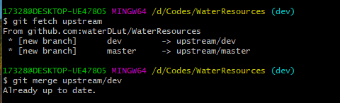
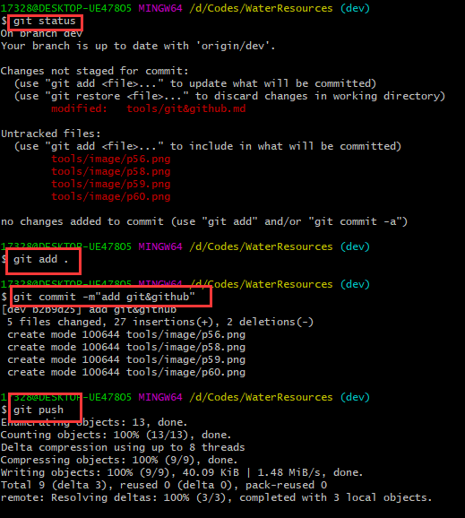

# 多人协作

这里以和本repo的交互为例，简单介绍下**waterDLut organization**下的repo，以及如何一起维护它。

本repo和**waterDLut organization**中的其他repo一起由**study-group** 和 **support** 两个team共同管理维护。

- study-group：主要由团队开发人员构成，负责分享基础知识、参与项目贡献，具有read、clone、push的权限。

- support：主要由项目服务人员构成，除了和study-group人员一起参与项目贡献外，还包括对项目的维护，审核pull request或者添加成员等操作。

如果我们在 waterDLut 内，直接在本repo下pull和push即可，不必fork到个人仓库（当然想fork的话也行）。

一般repo都有master分支和dev分支。master用来发布稳定版本，dev分支（开发分支）用来发布开发版本。

如果新建了一个repo还没有dev分支，那么由repo创建者在本地新建一个dev分支推送上去即可，或者如下图所示直接在github页面上点击输入分支名称后，下面会跳出Create branch，点击即可创建。

分支创建完毕后，会自动跳转到dev分支。由于dev分支是从master分支上创建的，因此刚建成时，内容与master分支一致。

下面是一起维护的基本流程。

## 1. git clone仓库到本地

克隆后，只能看到master分支，并没有把dev分支clone下来。使用 `git branch` 命令查看本地分支，发现本地只有master分支。

使用 `git branch -a` 查看所有分支，就能看到远程分支。

根据远程分支，我们可以用`git checkout -b dev origin/dev` 创建一个dev分支（-b），并把远程dev分支（origin/dev）的内容放在该分支内。接着切换到该分支（checkout）。

现在使用 `git branch` 可以查看两个分支，并且用 `ls` 或者 `dir` 就能看到dev分支的内容了。想切换回master分支的时候，再用 `git checkout master` 即可。

**注意：**

- 如果发现现有文档上有一些小问题，可以快速修改掉，那么请直接在 dev 分支上编辑更新现有内容；

- 如果有较大改变，那么请创建新的特性分支(feature_xxx)，然后再在此分支上编辑，这样可以避免混乱。如果是一个 feature_xxx 完成，那么请将其合并到dev分支上。

上面的操作完成后，就可以在本地进行开发了。但是如果要将修改完的代码合并到团队项目上，还需要进行下面的操作。

## 2 和团队项目保持同步

首先查看有没有设置upstream，使用 `git remote -v` 命令来查看。

如果没有显示upstream，则使用 `git remote add upstream` 团队项目地址命令。接着再次使用 `git remote -v` ，显示出了upstream，那么就设置好了。

开始同步。首先执行 `git fetch upstream` 获取团队项目最新版本。此时并没有把最新版本合并到本地的分支上，因此还需要一步。 **当前分支是dev分支，执行 `git merge upstream/dev` 命令后，会将源分支（upstream/dev）合并到当前分支（dev）。**

如果是在本地的master分支上开发，那么在使用该命令前，先切换到master分支。merge的时候，有可能碰到冲突。需要解决冲突才能继续下面的操作。

## 3 push修改到自己的项目上

解决冲突后，就可以使用 `git push` 命令将本地的修改同步到自己的GitHub仓库上了。注意，在当前所在分支使用push，会push到与这个分支相关联的远程仓库分支。这里dev分支与origin/dev关联，因此push到GitHub上的dev分支。

以上操作结束后，流程基本就结束了。最后一步交给 support小组来完成。

## 4 support小组审核后合并到master分支

首先在本地将修改后的远程dev分支pull下来,查看对项目做了哪些修改。如果没有问题，需要把代码合并到主分支 master上来，用`git checkout master` 切换到master分支，执行 `git merge dev` ，意思就是把dev 分支的代码合并过来，不出意外，这个时候 dev分支的代码就顺利合并到 master 分支来了，最后，将master分支push到远程即可。

**总结**

查看分支：`git branch`
 
创建分支：`git branch <name>`
 
切换分支：`git checkout <name>`
 
创建+切换分支：`git checkout -b <name>`
 
合并某分支到当前分支：`git merge <name>`
 
删除分支：`git branch -d <name>`

大家可对其进行补充！