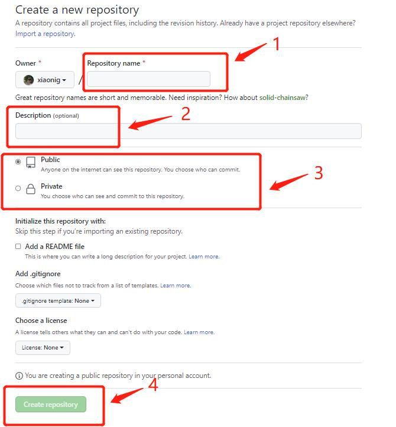
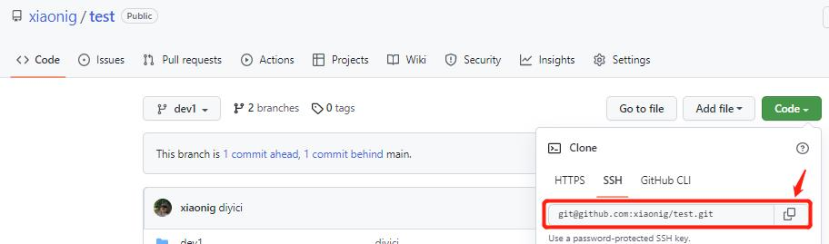
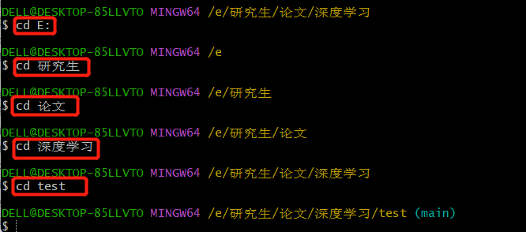
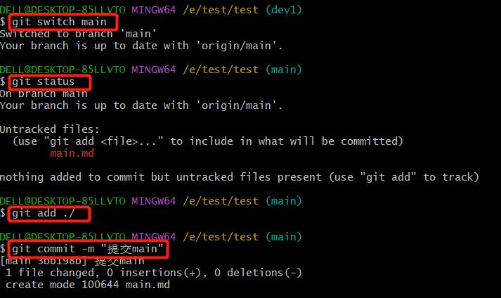
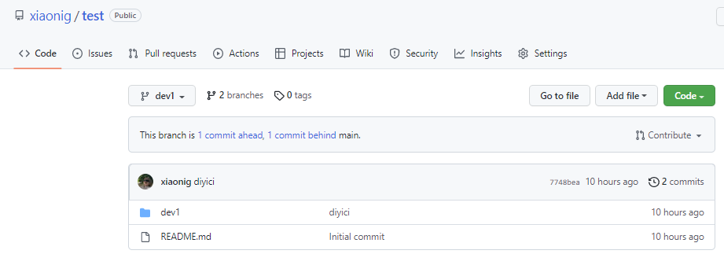

# GitHub仓库的基本使用

通过前面的章节我们已经学习到Git与GitHub的一些基本用法，在本节中，我们将学习如何在GitHub中创建分支以及如何将自己的本地项目上传到仓库中。下面就让我们一起来看看吧！

## 如何在GitHub仓库中上传文件

我们在做项目的过程中，可能会需要将一些软件代码储存在GitHub中来方便团队协作，那么如何在GitHub中上传文件呢？我们可以按照以下步骤：

一、 新建一个存储仓库

<<<<<<< HEAD

=======

>>>>>>> 8efa378cd8d8b2c0c99410cb977dcb17d384eb26

填写项目说明：

1. 填写仓库名称；

<<<<<<< HEAD

=======
2. 仓库说明描述；
>>>>>>> 8efa378cd8d8b2c0c99410cb977dcb17d384eb26

3. 根据需要确定所创建的仓库是Public or Private (Public是公开仓库，可以在GitHub上搜到，Private是私密仓库，只有自己和成员才能看到）；

<<<<<<< HEAD

=======
4. 点击Create repository（创建仓库），生成如下页面，在这里我们需要复制仓库的链接，后面会用到。
>>>>>>> 8efa378cd8d8b2c0c99410cb977dcb17d384eb26

二、 将本地文件上传到GitHub主页中

1. 在文件夹中找到所要上传的项目，选择Git Bash Here命令。

<<<<<<< HEAD

=======

>>>>>>> 8efa378cd8d8b2c0c99410cb977dcb17d384eb26

2. 点击Git Bash Here，输入git clone，并把之前在GitHub复制的链接粘上去（粘贴时鼠标右键点击paste，不要用快捷键ctrl+v）。

<<<<<<< HEAD

=======

>>>>>>> 8efa378cd8d8b2c0c99410cb977dcb17d384eb26

3. 输入cd+目标文件夹路径（注意如果这里出现 No such file or directory命令，原因是我们并不能一步就cd到指定文件夹，需要一步一步转换，即一步一步的到你指定路径，如下图所示。

<<<<<<< HEAD

=======
4. 输入git switch main：切换到main分支。
>>>>>>> 8efa378cd8d8b2c0c99410cb977dcb17d384eb26

5. 输入git status: 查看当前状态。

6. 输入git add ./：将项目上的所有文件添加到仓库中，如果想添加某个特定的文件，只需要把.换成特定的文件名即可。

7. 输入git commit -m "对信息的描述"。
      

      
8. 输入git push：将代码上传到github仓库。
      

9. 返回自己的GitHub仓库中查看文件是否提交成功。

## 如何创建分支

<<<<<<< HEAD

=======
Git分支是由指针管理起来的，所以创建、切换、合并、删除分支都非常快，非常适合大型项目的开发。在分支上做开发，调试好了后再合并到主分支。那么每个人开发模块式都不会影响到别人，这里有一些使用分支的策略，供大家参考：
- 主分支（默认创建的main分支）只用来分布重大版本（对于每个版本可以创建不同的标签，以便于查找）；
>>>>>>> 8efa378cd8d8b2c0c99410cb977dcb17d384eb26

- 日常开发可以在另一条分支上完成，可以取名为dev；

<<<<<<< HEAD

=======
- 临时性分支，用完后最好删除，以免分支混乱.
>>>>>>> 8efa378cd8d8b2c0c99410cb977dcb17d384eb26

了解完这些后，我们内心可能仍然会存在一些疑问，比如怎样创建分支呢？我们只需按照以下步骤就可以：

<<<<<<< HEAD

=======
1. 输入git branch,查看main分支；
>>>>>>> 8efa378cd8d8b2c0c99410cb977dcb17d384eb26

2. 输入git branch dev1，创建新分支dev1；

3. 输入git switch dev1,切换至dev1分支；

4. 如果想要往dev分支传送文件时，步骤和主分支类似，依次输入：git add ./、 git commit -m "对提交信息的描述"、git push origin dev1，这里不再赘述。
       

       
5. 输入完成后，在自己的GitHub主页上查看是否创建成功。

<<<<<<< HEAD

=======

>>>>>>> 8efa378cd8d8b2c0c99410cb977dcb17d384eb26

本章的学习就到这里了，希望可以帮助到大家！

