# 在GitHub上协作工作

通过前面的章节我们已经学习到Git与GitHub的一些基本用法，在本节中，两人一起，了解如何在GitHub中协同工作。

## 甲同志

### GitHub中创建代码仓

我们在做项目的过程中，可能会需要将一些软件代码储存在GitHub中来方便团队协作，那么如何在GitHub中上传文件呢？我们可以按照以下步骤：

一、 新建一个存储仓库

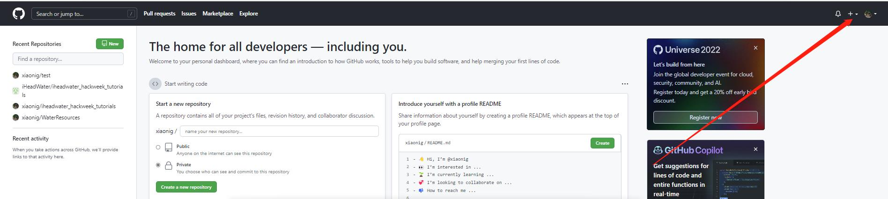

填写项目说明：

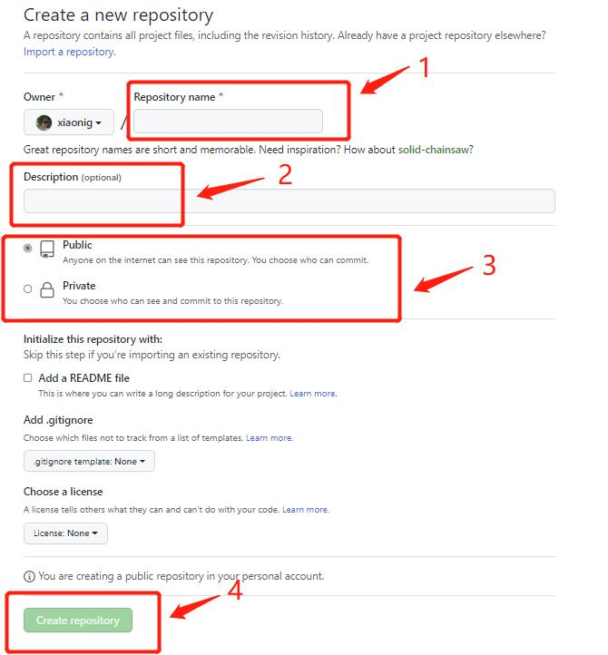

1. 填写仓库名称；

2. 仓库说明描述；

3. 根据需要确定所创建的仓库是Public or Private (Public是公开仓库，可以在GitHub上搜到，Private是私密仓库，只有自己和成员才能看到）；

4. 点击Create repository（创建仓库），生成如下页面，在这里我们需要复制仓库的链接，后面会用到。

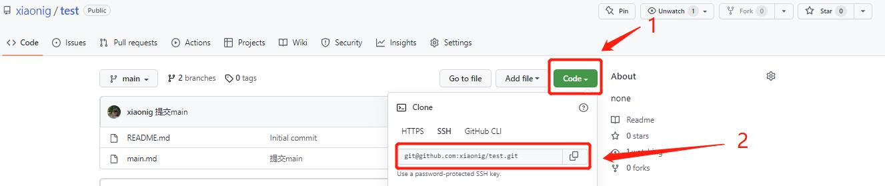

二、 将本地文件上传到GitHub主页中

1. 在文件夹中找到所要上传的项目，选择Git Bash Here命令。

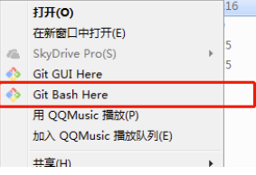

2. 点击Git Bash Here，输入git clone，并把之前在GitHub复制的链接粘上去（粘贴时鼠标右键点击paste，不要用快捷键ctrl+v）。

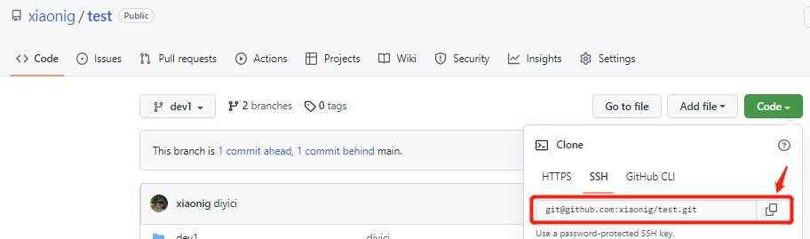

3. 输入cd+目标文件夹路径（注意如果这里出现 No such file or directory命令，原因是我们并不能一步就cd到指定文件夹，需要一步一步转换，即一步一步的到你指定路径，如下图所示。

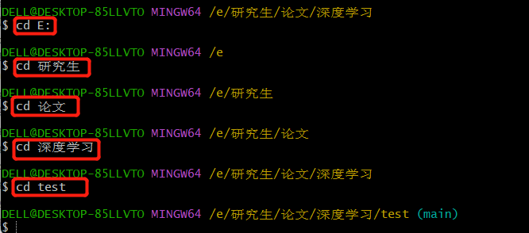

4. 输入git switch main：切换到main分支。

5. 输入git status: 查看当前状态。

6. 输入git add ./：将项目上的所有文件添加到仓库中，如果想添加某个特定的文件，只需要把.换成特定的文件名即可。

7. 输入git commit -m "对信息的描述"。
      
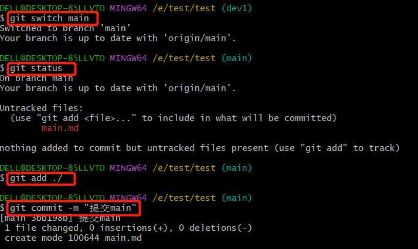
      
8. 输入git push：将代码上传到github仓库。
      
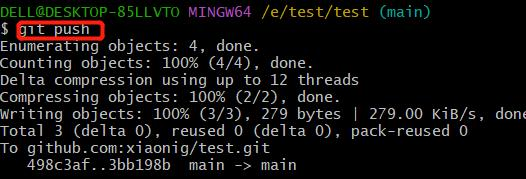

9. 返回自己的GitHub仓库中查看文件是否提交成功。

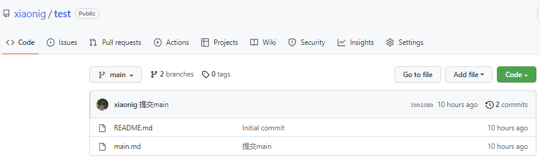

### 创建分支

Git分支是由指针管理起来的，所以创建、切换、合并、删除分支都非常快，非常适合大型项目的开发。在分支上做开发，调试好了后再合并到主分支。那么每个人开发模块式都不会影响到别人，这里有一些使用分支的策略，供大家参考：
- 主分支（默认创建的main分支）只用来分布重大版本（对于每个版本可以创建不同的标签，以便于查找）；

- 日常开发可以在另一条分支上完成，可以取名为dev；

- 临时性分支，用完后最好删除，以免分支混乱。

了解完这些后，我们内心可能仍然会存在一些疑问，比如怎样创建分支呢？我们只需按照以下步骤就可以：

1. 输入git branch,查看main分支；

2. 输入git branch dev1，创建新分支dev1；

3. 输入git switch dev1，切换至dev1分支；

4. 如果想要往dev分支传送文件时，步骤和主分支类似，依次输入：git add ./、 git commit -m "对提交信息的描述"、git push origin dev1，这里不再赘述。
       
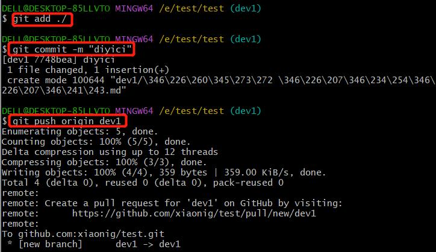
       
5. 输入完成后，在自己的GitHub主页上查看是否创建成功。

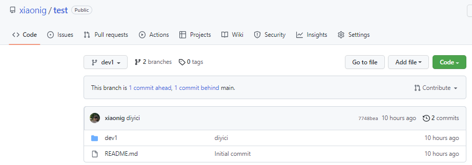

## 乙同志：和甲协作

通过以上内容，我们学会了如何进行多人协作。在我们进行多人协作时，团队成员如果同时修改一个文件的话，就会造成冲突。那么我们 push 之后，在Sync fork部分就会看到提示。遇到这种情况该怎么办呢，我们可以采取以下步骤：

1. 首先我们可以用`git remote -v`命令来查看远程仓库的信息，来看看我们是否设置了upstream。

**补充：**对于 upstream ，我们用户通俗。我们 fork 了一个项目，origin 则指向我们自己的项目，那么 upstream 指向 fork 的项目。

2. 如果没有显示 upstream ,我们可以使用`git remote add upstream 团队项目地址`命令。随后再次使用`git remote -v`，我们就可以看到 upstream 已经设置好了。

3. 开始进行同步。输入`git fetch upstream`来获取团队项目的最新版本。需要注意的是，经过上述的操作，我们并没有把最新版本合并到本地的分支上，因此还需要一步。**首先切换到我们进行修改的dev分支，如果我们已经处于此分支的话，输入`git merge upstream/dev`命令，就可以合并完成。**

4. 此时我们会发现会提示有CONFLICT，他会告诉我们哪个文件发生了冲突。然后我们再重新打开冲突的文件，把冲突的标识符以及我们不需要的东西删除，保留需要的东西。**冲突的标识符由<<<<<<<、=======、>>>>>>>组成**

5. 输入`git status`命令检查状态，并按照提示依次输入`git add`和`git commit -a`命令。

通过以上的操作，我们就将冲突解决了，之后就可以顺利地进行 push 等操作了。

**补充：**如果我们在.ipynb文件里面发现了冲突，与上述解决办法相似，将冲突的标识符以及不需要的内容删除，只保留想要的部分即可。

